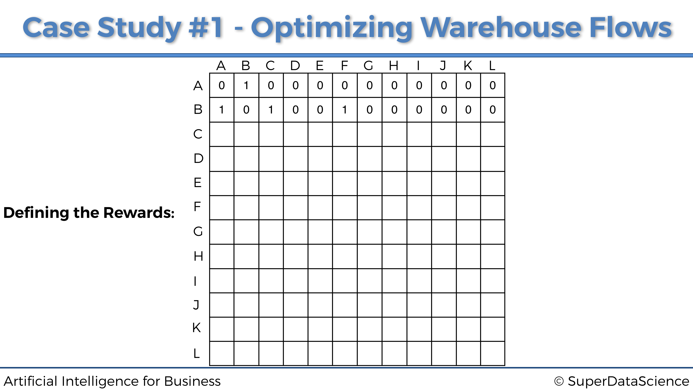
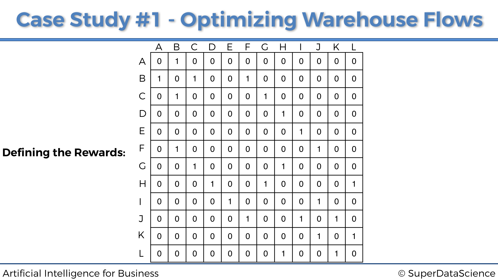
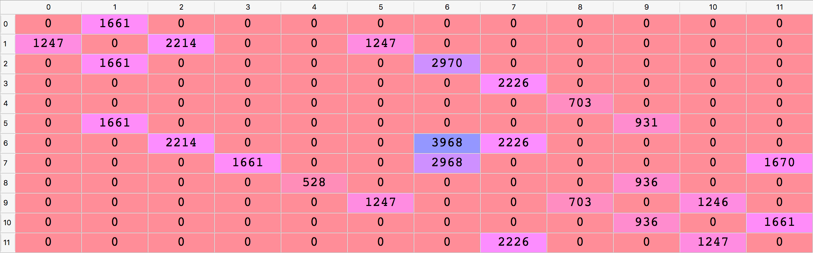

# Optimización de Procesos

Aquí vamos con nuestro primer caso práctico y nuestro primer modelo de IA. ¡Esperamos que estés listo!

## Caso Práctico: Optimización de tareas en un almacén de comercio electrónico

### Problema a resolver 

El problema a resolver será optimizar los flujos dentro del siguiente almacén:

{width=100%}

El almacén pertenece a una empresa online minorista que vende productos a una variedad de clientes. Dentro de este almacén, los productos se almacenan en 12 ubicaciones diferentes, etiquetadas con las siguientes letras de la A a la L:

{width=100%}


A medida que los clientes hacen los pedidos online, un robot de almacén autónomo se mueve por el almacén para recoger los productos para futuras entregas. Así es como se ve:

{width=100%}

Las 12 ubicaciones están conectadas a un sistema informático, que clasifica en tiempo real las prioridades de recolección de productos para estas 12 ubicaciones. Por ejemplo, en un momento específico $t$, devolverá la siguiente clasificación:

|**Rango de Prioridad** | **Ubicación**|
|:---------------------:|:---------------:|
1 | G 
2|K 
3|L 
4|J 
5|A 
6|I 
7|H 
8|C 
9|B 
10|D 
11|F 
12|E 
  

La ubicación G tiene prioridad 1, lo que significa que es la máxima prioridad, ya que contiene un producto que debe recogerse y entregarse de inmediato. Nuestro robot de almacén autónomo debe moverse a la ubicación G por la ruta más corta, dependiendo de dónde se encuentre. Nuestro objetivo es construir una IA que regrese esa ruta más corta, donde sea que esté el robot. Pero luego, como vemos, las ubicaciones K y L están en las 3 prioridades principales. Por lo tanto, querremos implementar una opción para que nuestro Robot de almacén autónomo pase por algunas ubicaciones intermedias antes de llegar a su ubicación final de máxima prioridad.

La forma en que el sistema calcula las prioridades de las ubicaciones está fuera del alcance de este caso práctico. La razón de esto es que puede haber muchas formas, desde reglas o algoritmos simples, hasta cálculos deterministas y aprendizaje automático. Pero la mayoría de estas formas no serían inteligencia artificial como la conocemos hoy. En lo que realmente queremos centrarnos es en la IA central, que abarca Q-Learning, Deep Q-Learning y otras ramas de Reinforcement Learning. Entonces, solo diremos, por ejemplo, que la ubicación G es la máxima prioridad porque uno de los clientes de platino más leales de la compañía hizo un pedido urgente de un producto almacenado en la ubicación G, que por lo tanto debe entregarse lo antes posible.


Por lo tanto, en conclusión, nuestra misión es construir una IA que siempre tome la ruta más corta a la ubicación de máxima prioridad, sea cual sea la ubicación desde la que comienza, y tener la opción de ir a una ubicación intermedia que se encuentre entre las 3 prioridades principales.


### Entorno a definir

Al construir una IA, lo primero que siempre tenemos que hacer es definir el entorno. Y definir un entorno siempre requiere los tres elementos siguientes:

* Definir los estados
* Definir las acciones
* Definir las recompensas

Definamos estos tres elementos, uno por uno.

**Definir los estados.**

Comencemos con los estados. El estado de entrada es simplemente la ubicación donde está nuestro Robot de almacén autónomo en cada momento $t$. Sin embargo, dado que construiremos nuestra IA con ecuaciones matemáticas, codificaremos los nombres de las ubicaciones (A, B, C, ...) en números de índice, con respecto a la siguiente asignación:

|**Ubicación** | **Estado** |
|:------------:|:----------:|
A | 0 
B | 1 
C | 2 
D | 3 
E | 4 
F | 5 
G | 6 
H | 7 
I | 8 
J | 9 
K | 10 
L | 11 


Hay una razón específica por la que codificamos los estados con índices del 0 al 11, en lugar de otros enteros. La razón es que trabajaremos con matrices, una matriz de recompensas y una matriz de valores Q, y cada línea y columna de estas matrices corresponderá a una ubicación específica. Por ejemplo, la primera línea de cada matriz, que tiene el índice 0, corresponde a la ubicación A. La segunda línea / columna, que tiene el índice 1, corresponde a la ubicación B. Etc. Veremos el propósito de trabajar con matrices con más detalles. un poco más tarde.


**Definir las acciones.**

Ahora definamos las posibles acciones a realizar Las acciones son simplemente los siguientes movimientos que el robot puede hacer para ir de un lugar a otro. Entonces, por ejemplo, digamos que el robot está en la ubicación J, las posibles acciones que el robot puede llevar a cabo es ir a I, F o K. Y nuevamente, ya que trabajaremos con ecuaciones matemáticas, codificaremos estas acciones con los mismos índices que para los estados. Por lo tanto, siguiendo nuestro mismo ejemplo donde el robot está en la ubicación J en un momento específico, las posibles acciones que el robot puede jugar son, de acuerdo con nuestro mapeo anterior anterior: 5, 8 y 10. De hecho, el índice 5 corresponde a F, el índice 8 corresponde a I y el índice 10 corresponde a K. Por lo tanto, eventualmente, la lista total de acciones que la IA puede llevar a cabo en general es la siguiente:

$$actions = [0,1,2,3,4,5,6,7,8,9,10,11]$$

Obviamente, al estar en una ubicación específica, hay algunas acciones que el robot no puede llevar a cabo. Tomando el mismo ejemplo anterior, si el robot está en la ubicación J, puede ejecutar las acciones 5, 8 y 10, pero no puede ejecutar las otras acciones. Nos aseguraremos de especificar eso al atribuir una recompensa 0 a las acciones que no puede llevar a cabo, y una recompensa 1 a las acciones que si puede realizar. Y eso nos lleva a las recompensas.

**Definir las recompensas.**

Lo último que tenemos que hacer ahora para construir nuestro entorno es definir un sistema de recompensas. Más específicamente, tenemos que definir una función de recompensa $R$ que toma como entradas un estado $s$ y una acción $a$, y devuelve una recompensa numérica que la IA obtendrá al llevar a cabo la acción $a$ en el estado $s$:


$$R : (\textrm{state}, \textrm{action}) \mapsto r \in \mathbb{R}$$

Entonces, ¿cómo vamos a construir esa función para nuestro caso práctico? Aquí esto es simple. Dado que hay un número discreto y finito de estados (los índices de 0 a 11), así como un número discreto y finito de acciones (mismos índices de 0 a 11), la mejor manera de construir nuestra función de recompensa R es simplemente hacer una matriz. Nuestra función de recompensa será exactamente una matriz de 12 filas y 12 columnas, donde las filas corresponden a los estados y las columnas corresponden a las acciones. De esa forma, en nuestra función $R: (s, a) \mapsto r \ in \mathbb{R} $, $s$ será el índice de la fila de la matriz, $a$ será el índice de la columna de matriz, y $r$ será la celda de los índices $(s, a)$ en la matriz.

Por lo tanto, lo único que tenemos que hacer ahora para definir nuestra función de recompensa es simplemente llenar esta matriz con las recompensas numéricas. Y como acabamos de decir en el párrafo anterior, lo que tenemos que hacer primero es atribuir, para cada una de las 12 ubicaciones, una recompensa 0 por las acciones que el robot no puede ejecutar, y una recompensa 1 por las acciones que el robot puede llevar a cabo. Al hacer eso para cada una de las 12 ubicaciones, terminaremos con una matriz de recompensas. Vamos a construirlo paso a paso, comenzando con la primera ubicación: 

*Ubicación A.*

Cuando se encuentra en la ubicación A, el robot solo puede ir a la ubicación B. Por lo tanto, dado que la ubicación A tiene el índice 0 (primera fila de la matriz) y la ubicación B tiene el índice 1 (segunda columna de la matriz), la primera fila de la matriz de las recompensas obtendrá un 1 en la segunda columna y un 0 en todas las otras columnas, así:


*Ubicación B.*

Al estar en la ubicación B, el robot solo puede ir a tres ubicaciones diferentes: A, C y F. Dado que B tiene el índice 1 (segunda fila), y A, C, F tienen los índices respectivos 0, 2, 5 (1ra, 3ra. , y sexta columna), entonces la segunda fila de la matriz de recompensas obtendrá un 1 en las columnas 1a, 3a y 6a, y 0 en todas las otras columnas. Por lo tanto obtenemos:



*Ubicación C.*

Ocurre lo mismo, la ubicación C (de índice 2) solo está conectada a B y G (de índices 1 y 6), por lo que la tercera fila de la matriz de recompensas es:


*En el resto de ubicaciones...*

Al hacer lo mismo para todas las demás ubicaciones, finalmente obtenemos nuestra matriz final de recompensas:



Felicidades, acabamos de definir las recompensas. Lo hicimos simplemente construyendo esta matriz de recompensas. Es importante entender que esta es la forma en que definimos el sistema de recompensas cuando hacemos Q-Learning con un número finito de entradas y acciones. En el Caso Práctico 2, veremos que procederemos de manera muy diferente.


Ya casi hemos terminado, lo único que tenemos que hacer es atribuir grandes recompensas a las ubicaciones de mayor prioridad. Esto lo hará el sistema informático que devuelve las prioridades de recolección de productos para cada una de las 12 ubicaciones. Por lo tanto, dado que la ubicación G es la máxima prioridad, el sistema informático actualizará la matriz de recompensas atribuyendo una alta recompensa en la celda $(G, G)$:


Y así es como el sistema de recompensas funcionará con Q-Learning. Atribuimos la recompensa más alta (aquí 1000) a la ubicación de máxima prioridad G. Luego puedes ver en las clases de vídeo del curso cómo podemos atribuir una recompensa más alta a la segunda ubicación de mayor prioridad (ubicación K), para hacer que nuestro robot pase por esto ubicación intermedia de máxima prioridad, optimizando así los flujos de movimiento por el almacén.

## Solución de Inteligencia Artificial

The AI Solution that will solve the problem described above is a Q-Learning model. Since the latter is based on Markov Decision Processes, or MDPs, we will start by explaining what they are, and then we will move on to the intuition and maths details behind the Q-Learning model.

### Proceso de Decisión de Markov

Un Proceso de Decisión de Markov es una tupla $(S, A, T, R)$ donde:

* $S$ es el conjunto de los diferentes estados. Por lo tanto, en nuestro caso de estudio: $$S = \{0,1,2,3,4,5,6,7,8,9,10,11\}$$
* $A$ es el conjunto de las diferentes acciones que se pueden llevar a cabo en cada momento $t$. Por lo tanto, en nuestro caso de estudio: $$A = \{0,1,2,3,4,5,6,7,8,9,10,11\}$$
* $T$ es la llamada regla de transición:

$$T : (s_t \in S, s_{t+1} \in S, a_t \in A) \mapsto \mathbb{P}(s_{t+1}|s_t,a_t)$$

donde $\mathbb {P} (s_{t + 1} | s_t, a_t)$ es la probabilidad de alcanzar el estado futuro $s_{t + 1}$ cuando se lleva a cabo la acción $a_t$ en el estado $s_t$. Por lo tanto, $T$ es la distribución de probabilidad de los estados futuros en el tiempo $t + 1$ dado el estado actual y la acción ejecutada en el tiempo $t$. En consecuencia, podemos predecir el estado futuro $s_{t + 1}$ tomando un valor aleatorio de esa distribución $T$:

$$s_{t+1} \sim T(s_t,.,a_t)$$

En nuestro estudio de caso, verás a través de nuestra implementación que esta distribución $T$ de nuestra IA simplemente será la distribución uniforme, que es una opción clásica de distribución que funciona muy bien en el marco del Q-Learning.

* $R$ es la función de recompensas:

$$R : (s_t \in S, a_t \in A) \mapsto r_t \in \mathbb{R}$$

donde $r_t$ es la recompensa obtenida después de ejecutar la acción $a_t$ en el estado $s_t$. En nuestro caso práctico, esta función de recompensa es exactamente la matriz que definimos previamente.

Después de definir el proceso de decisión de Markov, ahora es importante recordar que se basa en el siguiente supuesto: la probabilidad del estado futuro $s_{t + 1}$ solamente depende del estado actual $s_t$ y la acción ejecutada $a_t$, y bajo ningun concepto no depende de ninguno de los estados y acciones anteriores. Es decir:

$$\mathbb{P}(s_{t+1}|s_0,a_0,s_1,a_1,...,s_t,a_t) = \mathbb{P}(s_{t+1}|s_t,a_t)$$

En otras palabras, un proceso de decisión de Markov no tiene memoria.

\newpage

Ahora repasemos lo que va a ocurrir en términos de un proceso de decisión de Markov. En cada instante $t$:

* La IA observa el estado actual $s_t$.
* La IA ejecuta la acción $a_t$.
* La IA recibe la recompensa $r_t = R(s_t, a_t)$.
* La IA entra en el siguiente estado $s_{t+1}$.

Así que la pregunta clave es:

> **¿Cómo sabe la IA qué acción llevar a cabo en cada instante $t$?**

Para responder a esta pregunta, necesitamos introducir la función de política. La función de política $\pi$ es exactamente la función que, dado un estado $s_t$, devuelve la acción $a_t$:

$$\pi: s_t \in S \mapsto a_t \in A$$

Denotemos por $\Pi$ el conjunto de todas las funciones de política posibles. Entonces, la elección de las mejores acciones para jugar se convierte en un problema de optimización. De hecho, se trata de encontrar la política óptima $\pi^*$ que maximice la recompensa acumulada:

$$\pi^* = \underset{\pi \in \Pi}{\textrm{argmax}} \sum_{t \ge 0} R(s_t,\pi(s_t))$$

Por lo tanto, la pregunta anterior se convierte en:

> **¿Cómo encontrar esta política óptima $\pi^*$?**

Aquí es donde entra en juego el Q-Learning.

### Q-Learning

Antes de comenzar a entrar en los detalles de Q-Learning, necesitamos explicar el concepto del valor Q.

**El valor Q**

Para cada par de estado y acción $(s, a)$, vamos a asociar un valor numérico llamado $Q (s, a)$:


$$Q: (s \in S, a \in A) \mapsto Q(s,a) \in \mathbb{R}$$

Diremos que $Q (s, a)$ es *el valor Q de la acción $a$ llevada a cabo en el estado $s$*.

Para comprender el propósito de este *Valor Q*, necesitamos introducir la Diferencia Temporal.


**La Diferencia Temporal**

Al principio $t = 0$, todos los valores Q se inicializan a 0:

$$\forall s \in S, a \in A, Q(s,a) = 0$$


Ahora supongamos que estamos en el instante $t$, en cierto estado $s_t$. Llevamos a cabo una acción aleatoria $a_t$, que nos lleva al estado $s_{t + 1}$ y obtenemos la recompensa $R(s_t, a_t)$.

Ahora podemos presentar la diferencia temporal, que básicamente es el corazón de Q-Learning. La diferencia temporal en el tiempo $t$, denotada por $TD_t(s_t, a_t)$, es la diferencia entre:

* $R(s_t,a_t) + \gamma \underset{a}{\max}(Q(s_{t+1},a))$, es decir la recompensa $R (s_t, a_t)$ obtenida al llevar a cabo la acción $a_t$ en el estado $s_t$, más el valor Q de la mejor acción jugada en el estado futuro $s_{t + 1}$, descontado por un factor $\gamma \in [0,1] $, llamado factor de descuento.

* y $Q(s_t, a_t)$, es decir el valor Q de la acción $a_t$ llevada a cabo en el estado $ s_t $,

que nos lleva a:

$$TD_t(s_t,a_t) = R(s_t,a_t) + \gamma \underset{a}{\max}(Q(s_{t+1},a)) - Q(s_t,a_t)$$

> **Bien, genial, pero ¿cuál es exactamente el propósito de esta diferencia temporal $TD_t(s_t,a_t)$?**


Respondamos esta pregunta para darnos una mejor idea de la IA. $TD_t (s_t, a_t)$ es como una recompensa intrínseca. La IA aprenderá los valores Q de tal manera que:

* Si $TD_t(s_t,a_t)$ es alta, la IA recibe una *buena sorpresa*.
* Si $TD_t(s_t,a_t)$ es alta, la IA recibe *frustración*.

En ese sentido, la IA repetirá algunas actualizaciones de los valores Q (a través de una ecuación llamada la ecuación de Bellman) hacia diferencias temporales más altas.


En consecuencia, en el siguiente paso final del algoritmo Q-Learning, usamos la diferencia temporal para reforzar los pares (estado, acción) desde el tiempo $t-1$ hasta el tiempo $t$, de acuerdo con la siguiente ecuación:

$$Q_t(s_t,a_t) = Q_{t-1}(s_t,a_t) + \alpha TD_t(s_t,a_t)$$

donde $\alpha \in \mathbb{R}$ es la tasa de aprendizaje, que determina qué tan rápido va el aprendizaje de los valores Q o qué tan grandes son las actualizaciones de los mismos. Su valor suele ser un número real elegido entre 0 y 1, como por ejemplo 0.01, 0.05, 0.1 o 0.5. Cuanto menor sea su valor, más pequeñas serán las actualizaciones de los valores Q y más larga será la ejecución del algoritmo de Q-Learning. Cuanto mayor sea su valor, mayores serán las actualizaciones de los valores Q y más rápido será el algoritmo de Q-Learning.


Esta ecuación anterior es la ecuación de Bellman. Es el pilar fundamental del Q-Learning.


Con este punto de vista, los valores Q miden la acumulación de sorpresa o frustración asociada con el par de acciones y estados $(s_t, a_t)$. En el caso de recibir sorpresa, la IA se refuerza, y en el caso de recibir frustración, la IA se debilita. Por lo tanto, queremos aprender los valores Q que le darán a la IA la máxima *buena sorpresa*.

En consecuencia, la decisión de qué acción ejecutar depende principalmente del valor Q $Q(s_t, a_t)$. Si la acción $a_t$ ejecutada en el estado $s_t$ está asociada con un valor Q alto $Q (s_t, a_t)$, la IA tendrá una mayor tendencia a elegir la acción $a_t$. Por otro lado, si la acción $a_t$ que se ha llevado a cabo en el estado $s_t$ está asociada con un valor Q pequeño $Q(s_t, a_t)$, la IA tendrá una tendencia menor a elegir la acción $a_t$.

Hay varias formas de elegir la mejor acción para ejecutar en cada esstado. Primero, cuando estamos en cierto estado $s_t$, simplemente podríamos tomar la acción $a_t$ que maximiza el valor Q $ Q(s_t, a_t)$:

$$a_t = \underset{a}{\textrm{argmax}}(Q(s_t,a))$$

Esta solución es el método **Argmax**.

Otra gran solución, que resulta ser una solución aún mejor para problemas complejos, es el método **Softmax**.

El método Softmax consiste en considerar para cada estado $s$ la siguiente distribución:

$$W_s: a \in A \mapsto \frac{\exp(Q(s,a))^{\tau}}{\sum_{a'}\exp(Q(s,a'))^{\tau}} \textrm{ with } \tau \ge 0$$

Luego, elegimos qué acción $a$ llevar a cabo mediante una muestra de un valor aleatorio de esa distribución:

$$a \sim W_s(.)$$

Sin embargo, el problema que resolveremos en el Caso Práctico 1 será lo suficientemente simple como para usar el método Argmax, así que esto es lo que elegiremos.

### El algoritmo de Q-Learning al completo

Resumamos los diferentes pasos de todo el proceso de Q-Learning:

**Inicialización**

Para todas las parejas de estados $s$ y acciones $a$, los valores Q se inicializan a 0:

$$\forall s \in S, a \in A, Q_0(s,a) = 0$$

Comenzamos en el estado inicial $s_0$. Llevamos a cabo una acción aleatoria posible y llegamos al primer estado $s_1$.

**Para cada instante $t \ge 1$**, repetiremos un cierto número de veces (1000 veces en nuestro código) lo siguiente:

* Seleccionamos un estado aleatorio $s_t$ de nuestros 12 estados posibles:

$$s_t = \textrm{random}(0,1,2,3,4,5,6,7,8,9,10,11)$$

* Llevamos a cabo una acción aleatoria $a_t$ que puede conducir al siguiente estado posible, es decir, de modo que $R(s_t,a_t) > 0$:

$$a_t = \textrm{random}(0,1,2,3,4,5,6,7,8,9,10,11) \textrm{ t.q. } R(s_t,a_t) > 0$$

* Llegamos al siguiente estado $s_{t + 1}$ y obtenemos la recompensa $R(s_t,a_t)$

* Calculamos la Diferencia Temporal $TD_t(s_t,a_t)$:

$$TD_t(s_t,a_t) = R(s_t,a_t) + \gamma \underset{a}{\max}(Q(s_{t+1},a)) - Q(s_t, a_t)$$

* Actualizamos el valor Q aplicando la ecuación de Bellman:

$$Q_t(s_t,a_t) = Q_{t-1}(s_t,a_t) + \alpha TD_t(s_t,a_t)$$

## Implementación

Ahora proporcionemos y expliquemos la implementación completa de este modelo de Q-Learning, la solución de nuestro problema de optimización de flujos de almacén.

Primero, comenzamos importando las librerías que se usarán en esta implementación. Estos solo incluyen la biblioteca `numpy`, que ofrece una forma práctica de trabajar con matrices y operaciones matemáticas:

```{python}
# Importar las librerías
import numpy as np
```

Luego establecemos los parámetros de nuestro modelo. Estos incluyen el factor de descuento $\gamma$ y la tasa de aprendizaje $\alpha $, que como vimos en la Sección 1.2, son los únicos parámetros del algoritmo Q-Learning:

```{python, eval=T}
# Configuración de los parámetros gamma y alfa para el Q-Learning
gamma = 0.75
alpha = 0.9
```

Las dos secciones de código anteriores eran simplemente las secciones introductorias, antes de comenzar realmente a construir nuestro modelo de IA. Ahora el siguiente paso es comenzar la primera parte de nuestra implementación: Parte 1 - Definición del entorno. Y para eso, por supuesto, comenzamos definiendo los estados, con un diccionario que asigna los nombres de las ubicaciones (en letras de la A a la L) en los estados (en índices del 0 al 11):

```{python, eval=T}
# PARTE 1 - DEFINICIÓN DEL ENTORNO

# Definición de los estados
location_to_state = {'A': 0,
                     'B': 1,
                     'C': 2,
                     'D': 3,
                     'E': 4,
                     'F': 5,
                     'G': 6,
                     'H': 7,
                     'I': 8,
                     'J': 9,
                     'K': 10,
                     'L': 11}
```

Luego definimos las acciones, con una simple lista de índices del 0 al 11. Recuerda que cada índice de acción corresponde al siguiente estado (siguiente ubicación) al que conduce dicha acción:

```{python, eval=T}
# Definición de las acciones
actions = [0,1,2,3,4,5,6,7,8,9,10,11]
```


Y eventualmente, definimos las recompensas, creando una matriz de recompensas, donde las filas corresponden a los estados actuales $s_t$, las columnas corresponden a las acciones $a_t$ que conducen al siguiente estado $s_{t + 1}$, y las celdas contienen las recompensas $R(s_t, a_t)$. Si una celda $(s_t, a_t)$ tiene un 1, eso significa que podemos llevar a cabo la acción $a_t$ del estado actual $s_t$ para llegar al siguiente estado $s_{t + 1}$. Si una celda $(s_t, a_t)$ tiene un 0, eso significa que no podemos llevar a cabo la acción $a_t$ del estado actual $s_t$ para llegar a cualquier estado siguiente $s_{t + 1}$. Y por ahora colocaremos manualmente una alta recompensa (1000) dentro de la celda correspondiente a la ubicación G, porque es la ubicación de máxima prioridad donde el almacén autónomo tiene que ir a recoger los productos. Como la ubicación G ha codificado el estado como índice 6, colocamos una recompensa de 1000 en la celda de la fila 6 y la columna 6. Luego, mejoraremos nuestra solución al implementar una forma automática de ir a la ubicación de máxima prioridad, sin tener que actualizar manualmente la matriz de recompensas y dejándola inicializada con 0s y 1s como debería ser. Pero mientras tanto, aquí está debajo de nuestra matriz de recompensas, incluida la actualización manual:

```{python, eval=T}
# Definición de las recompensas
R = np.array([[0,1,0,0,0,0,0,0,0,0,0,0],
              [1,0,1,0,0,1,0,0,0,0,0,0],
              [0,1,0,0,0,0,1,0,0,0,0,0],
              [0,0,0,0,0,0,0,1,0,0,0,0],
              [0,0,0,0,0,0,0,0,1,0,0,0],
              [0,1,0,0,0,0,0,0,0,1,0,0],
              [0,0,1,0,0,0,1000,1,0,0,0,0],
              [0,0,0,1,0,0,1,0,0,0,0,1],
              [0,0,0,0,1,0,0,0,0,1,0,0],
              [0,0,0,0,0,1,0,0,1,0,1,0],
              [0,0,0,0,0,0,0,0,0,1,0,1],
              [0,0,0,0,0,0,0,1,0,0,1,0]])
```

Eso finaliza esta primera parte. Ahora comencemos la segunda parte de nuestra implementación: Parte 2 - Construcción la solución de IA con Q-Learning. En ese sentido, vamos a seguir el algoritmo de Q-Learning exactamente como lo vimos en la Sección 1.2. Por lo tanto, primero inicializamos todos los valores Q, creando nuestra matriz de valores Q llena de ceros (en los cuales, las filas corresponden a los estados actuales $s_t$, las columnas corresponden a las acciones $a_t$ que conducen al siguiente estado $s_{t + 1} $, y las celdas contienen los valores Q, $Q (s_t, a_t)) $:

```{python, eval=T}
# PARTE 2 - CONSTRUCCIÓN DE LA SOLUCIÓN DE IA CON Q-LEARNING

# Inicialización de los valores Q
Q = np.array(np.zeros([12,12]))
```

Luego, por supuesto, implementamos el proceso de Q-Learning, con un bucle `for` que llevará a cabo un total de 1000 iteraciones, repitiendo 1000 veces los pasos del proceso de Q-Learning que analizamos a fondo al final de la Sección 1.2:

```{python, eval=F}
# Implementación del proceso de Q-Learning
for i in range(1000):
    current_state = np.random.randint(0,12)
    playable_actions = []
    for j in range(12):
        if R[current_state, j] > 0:
            playable_actions.append(j)
    next_state = np.random.choice(playable_actions)
    TD = R[current_state, next_state] + gamma*Q[next_state, np.argmax(Q[next_state,])]
         - Q[current_state, next_state]
    Q[current_state, next_state] = Q[current_state, next_state] + alpha*TD
```

Opcional: en esta etapa del código, nuestra matriz de valores Q está lista. Podemos echarle un vistazo ejecutando todo el código que hemos implementado hasta ahora e ingresando las siguientes dos instrucciones en la consola:

```{python, eval=F}
print("Q-Values:")
print(Q.astype(int))
```

Y obtenemos la siguiente matriz de valores Q finales:


Para una mayor claridad visual, incluso puede verificarse la matriz de valores Q directamente en el Explorador de variables, haciendo doble clic en la variable Q. Luego, para obtener los valores Q como enteros, es conveniente hacer clic en `Formato` e ingresar un formato de como floante como `%.0f`. Se obtiene en este caso el siguiente resultado, que es un poco más claro ya que se pueden ver en la matriz Q  los índices de las filas y columnas de la misma:



Bien, ahora que tenemos nuestra matriz de valores Q, ¡estamos listos para llevarlo a producción! Por lo tanto, podemos pasar a la tercera parte de la implementación, Parte 3: Poner el modelo en producción, dentro de la cual calcularemos la ruta óptima desde cualquier ubicación inicial a cualquier ubicación final de máxima prioridad. La idea aquí será implementar una función de *ruta*, que tomará como entradas la ubicación de inicio donde se encuentra nuestro robot de almacén autónomo en un momento específico y la ubicación de finalización donde tiene que ir con la máxima prioridad, y eso volverá como genera la ruta más corta dentro de una lista. Sin embargo, dado que queremos indicar las ubicaciones con sus nombres (en letras), a diferencia de sus estados (en índices), necesitaremos un diccionario que asigne los estados de ubicaciones (en índices) a los nombres de ubicaciones (en letras). Y eso es lo primero que haremos aquí en esta tercera parte, usando un truco para invertir nuestro diccionario anterior `location\_to\_state`, ya que de hecho simplemente queremos obtener el mapeo inverso exacto de este diccionario:

```{python, eval=F}
# PARTE 3 - PONER EL MODELO EN PRODUCCIÓN

# Hacer un mapeo de los estados a las ubicaciones
state_to_location = {state: location for location, state in location_to_state.items()}
```

Aquí es cuando entra en juego la sección de código más importante. Estamos a punto de implementar la función final `route ()` que tomará como entradas las ubicaciones de inicio y finalización, y que devolverá la ruta óptima entre estas dos ubicaciones. Para explicar exactamente qué hará esta función de ruta, enumeremos los diferentes pasos del proceso, al pasar de la ubicación E a la ubicación G:

1. Comenzamos en nuestra ubicación inicial E.
2. Obtenemos el estado de ubicación E, que según nuestro mapeo `location_to_state` es $s_0 = 4$.
3. En la fila del estado $s_0 = 4$ de nuestra matriz de valores Q, hallamos la columna con el mayor valor Q (703).
4. Esta columna tiene el índice 8, por lo que ejecutamos la acción del índice 8 que nos lleva al siguiente estado $s_{t+1} = 8$.
5. Obtenemos la ubicación del estado 8, que según nuestro mapeo `state_to_location` es la ubicación I. Por lo tanto, nuestra próxima ubicación es la ubicación I, que se adjunta a nuestra lista que contiene la ruta óptima global.
6. Repetimos los mismos 5 pasos anteriores desde nuestra nueva ubicación inicial I, hasta llegar a nuestro destino final, la ubicación G.

Por lo tanto, dado que no sabemos cuántas ubicaciones tendremos que atravesar entre las ubicaciones inicial y final, tenemos que hacer un bucle `while` que repetirá el proceso de 5 pasos descrito anteriormente, y que se detendrá tan pronto como lo hagamos llegar a la ubicación final de máxima prioridad:

```{python, eval=F}
# Hacer la función final que devolverá la ruta óptima
def route(starting_location, ending_location):
    route = [starting_location]
    next_location = starting_location
    while (next_location != ending_location):
        starting_state = location_to_state[starting_location]
        next_state = np.argmax(Q[starting_state,])
        next_location = state_to_location[next_state]
        route.append(next_location)
        starting_location = next_location
    return route
``` 

¡Felicidades, nuestra herramienta ya está lista! Cuando lo probamos para ir de E a G, obtenemos las dos rutas óptimas posibles después de imprimir la ruta final ejecutando el código completo varias veces:

```{python, eval=F}
# Imprimir la ruta final
print('Route:')
route('E', 'G')
```

```python
Route:
Out[1]: ['E', 'I', 'J', 'F', 'B', 'C', 'G']
Out[2]: ['E', 'I', 'J', 'K', 'L', 'H', 'G']
``` 

Bien, tenemos una primera versión del modelo que funciona bien. Pero podemos mejorarlo de dos maneras. Primero, al automatizar la atribución de recompensas a la ubicación de máxima prioridad, para que no tengamos que hacerlo manualmente. Y segundo, al agregar una función que nos da la opción de ir a una ubicación intermedia antes de ir a la ubicación de máxima prioridad. Esa ubicación intermedia debe estar, por supuesto, en las 3 ubicaciones prioritarias principales. Y, de hecho, en nuestra clasificación de ubicaciones de máxima prioridad, la segunda ubicación de máxima prioridad es la ubicación K. Por lo tanto, para optimizar aún más los flujos de almacén, nuestro robot de almacén autónomo debe ir por la ubicación K para recoger los productos en su camino a la ubicación de máxima prioridad G. Una forma de hacer esto es tener la opción de ir a cualquier ubicación intermedia en el proceso de nuestra función `route()`. Y esto es exactamente lo que implementaremos como segunda mejora. Pero primero, implementemos la primera mejora, que automatiza la atribución de recompensas.

La forma de hacerlo es en dos pasos: primero debemos hacer una copia (llamada `R_new`) de nuestra matriz de recompensa dentro de la cual la función `route()` actualizará automáticamente la recompensa en la celda de la ubicación final. De hecho, la ubicación final es una de las entradas de la función `route()`, por lo que al usar nuestro diccionario de `location_to_state` podemos encontrar fácilmente esa celda y actualizar su recompensa a 1000. Y segundo, debemos incluir toda la lógica del algoritmo de Q-learning (incluido el paso de inicialización) dentro de la función de ruta, justo después de hacer esa actualización de la recompensa en nuestra copia de la matriz de recompensas. De hecho, en nuestra implementación anterior anterior, el proceso de Q-Learning ocurre en la versión original de la matriz de recompensas, que ahora se supone que permanece como está, es decir, se inicializa solo a 1s y 0s. Por lo tanto, debemos incluir el proceso de Q-Learning dentro de la función de ruta y hacer que suceda en nuestra copia `R_new` de la matriz de recompensas, en lugar de la matriz de recompensas original `R`. Por lo tanto, nuestra implementación completa se convierte en lo siguiente:

```{python, eval=F}
# Inteligencia Artificial aplicada a Negocios y Empresas

# Optimización de Procesos en un almacén con Q-Learning

# # Importar las librerías
import numpy as np

# Configuración de los parámetros gamma y alfa para el Q-Learning
gamma = 0.75
alpha = 0.9

# PARTE 1 - DEFINICIÓN DEL ENTORNO

# Definición de los estados
location_to_state = {'A': 0,
                     'B': 1,
                     'C': 2,
                     'D': 3,
                     'E': 4,
                     'F': 5,
                     'G': 6,
                     'H': 7,
                     'I': 8,
                     'J': 9,
                     'K': 10,
                     'L': 11}

# Definición de las acciones
actions = [0,1,2,3,4,5,6,7,8,9,10,11]

# Definición de las recompensas
R = np.array([[0,1,0,0,0,0,0,0,0,0,0,0],
              [1,0,1,0,0,1,0,0,0,0,0,0],
              [0,1,0,0,0,0,1,0,0,0,0,0],
              [0,0,0,0,0,0,0,1,0,0,0,0],
              [0,0,0,0,0,0,0,0,1,0,0,0],
              [0,1,0,0,0,0,0,0,0,1,0,0],
              [0,0,1,0,0,0,1,1,0,0,0,0],
              [0,0,0,1,0,0,1,0,0,0,0,1],
              [0,0,0,0,1,0,0,0,0,1,0,0],
              [0,0,0,0,0,1,0,0,1,0,1,0],
              [0,0,0,0,0,0,0,0,0,1,0,1],
              [0,0,0,0,0,0,0,1,0,0,1,0]])

# PARTE 2 - CONSTRUCCIÓN DE LA SOLUCIÓN DE IA CON Q-LEARNING

# Crear una función de mapping desde los estados a las ubicaciones
state_to_location = {state: location for location, state in location_to_state.items()}

# Crear una función que devuelva el camino más corto desde la ubicación inicial a la final
def route(starting_location, ending_location):
    R_new = np.copy(R)
    ending_state = location_to_state[ending_location]
    R_new[ending_state, ending_state] = 1000
    Q = np.array(np.zeros([12,12]))
    for i in range(1000):
        current_state = np.random.randint(0,12)
        playable_actions = []
        for j in range(12):
            if R_new[current_state, j] > 0:
                playable_actions.append(j)
        next_state = np.random.choice(playable_actions)
        TD = R_new[current_state, next_state]
             + gamma * Q[next_state, np.argmax(Q[next_state,])]
             - Q[current_state, next_state]
        Q[current_state, next_state] = Q[current_state, next_state] + alpha * TD
    route = [starting_location]
    next_location = starting_location
    while (next_location != ending_location):
        starting_state = location_to_state[starting_location]
        next_state = np.argmax(Q[starting_state,])
        next_location = state_to_location[next_state]
        route.append(next_location)
        starting_location = next_location
    return route

# PARTE 3 - PONER EL MODELO EN PRODUCCIÓN

# Imprimir la ruta final
print('Route:')
route('E', 'G')
```

Al ejecutar este nuevo código varias veces, obtenemos, por supuesto, las mismas dos posibles rutas óptimas que antes.

Ahora abordemos la segunda mejora. Hay tres formas de agregar la opción de ir por la ubicación intermedia K, la segunda ubicación de máxima prioridad:

1. Otorgamos una alta recompensa a la acción que lleva de la ubicación J a la ubicación K. Esta alta recompensa debe ser mayor que 1 y menor a 1000. De hecho, debe ser mayor que 1 para que el proceso de Q-Learning favorezca la acción que lleva de J a K, en oposición a la acción que lleva de J a F que tiene la recompensa 1. Y debe ser inferior a 1000, por lo que debemos mantener la recompensa más alta en la ubicación de mayor prioridad para asegurarnos de que terminemos allí. Por lo tanto, por ejemplo, en nuestra matriz de recompensas podemos dar una alta recompensa de 500 a la celda en la fila del índice 9 y la columna del índice 10, ya que de hecho esa celda corresponde a la acción que conduce desde la ubicación J (índice de estado 9) a ubicación K (índice de estado 10). De esa manera, nuestro robot de almacén autónomo siempre irá por la ubicación K en su camino hacia la ubicación G. Así es como sería la matriz de recompensas en ese caso:

```{python, eval=T}
# Definición de las recompensas
R = np.array([[0,1,0,0,0,0,0,0,0,0,0,0],
          [1,0,1,0,0,1,0,0,0,0,0,0],
          [0,1,0,0,0,0,1,0,0,0,0,0],
          [0,0,0,0,0,0,0,1,0,0,0,0],
          [0,0,0,0,0,0,0,0,1,0,0,0],
          [0,1,0,0,0,0,0,0,0,1,0,0],
          [0,0,1,0,0,0,1,1,0,0,0,0],
          [0,0,0,1,0,0,1,0,0,0,0,1],
          [0,0,0,0,1,0,0,0,0,1,0,0],
          [0,0,0,0,0,1,0,0,1,0,500,0],
          [0,0,0,0,0,0,0,0,0,1,0,1],
          [0,0,0,0,0,0,0,1,0,0,1,0]])
``` 

2. Damos una mala recompensa a la acción que lleva de la ubicación J a la ubicación F. Esta mala recompensa solo tiene que ser inferior a 0. De hecho, al castigar esta acción con una mala recompensa, el proceso de Q-Learning nunca favorecerá esa acción que lleva de J a F. Por lo tanto, por ejemplo, en nuestra matriz de recompensas podemos dar una mala recompensa de -500 a la celda en la fila del índice 9 y la columna del índice 5, ya que esa celda corresponde a la acción que conduce desde la ubicación J (estado con índice 9) a la ubicación F (estado con índice 5). De esa manera, nuestro robot de almacén autónomo nunca pasará por la ubicación F en su camino hacia la ubicación G. Así es como sería la matriz de recompensas en ese caso:

```{python, eval=T}
# Definición de las recompensas
R = np.array([[0,1,0,0,0,0,0,0,0,0,0,0],
          [1,0,1,0,0,1,0,0,0,0,0,0],
          [0,1,0,0,0,0,1,0,0,0,0,0],
          [0,0,0,0,0,0,0,1,0,0,0,0],
          [0,0,0,0,0,0,0,0,1,0,0,0],
          [0,1,0,0,0,0,0,0,0,1,0,0],
          [0,0,1,0,0,0,1,1,0,0,0,0],
          [0,0,0,1,0,0,1,0,0,0,0,1],
          [0,0,0,0,1,0,0,0,0,1,0,0],
          [0,0,0,0,0,-500,0,0,1,0,1,0],
          [0,0,0,0,0,0,0,0,0,1,0,1],
          [0,0,0,0,0,0,0,1,0,0,1,0]])
```

3. Realizamos una  función adicional `best_route()`, tomando como entradas las tres ubicaciones inicial, intermedia y final, que llamará a nuestra función `route()` anterior dos veces, una primera vez desde la ubicación inicial a la ubicación intermedia, y un segunda vez desde la ubicación intermedia hasta la ubicación final.

Las dos primeras ideas son fáciles de implementar manualmente, pero muy difíciles de implementar automáticamente. De hecho, es fácil encontrar automáticamente el índice de la ubicación intermedia donde queremos ir, pero es muy difícil obtener el índice de la ubicación que lleva a esa ubicación intermedia, ya que depende de la ubicación inicial y la ubicación final. Puedes intentar implementar la primera o la segunda idea, y verás lo que quiero decir. En consecuencia, implementaremos la tercera idea, que puede programarse en solo dos líneas adicionales de código:

```{python, eval=F}
# Hacer la función final que devuelve la ruta óptima
def best_route(starting_location, intermediary_location, ending_location):
    return route(starting_location, intermediary_location)
           + route(intermediary_location, ending_location)[1:]
```

Finalmente, el código final que incluye esa mejora importante para la optimización de los flujos de nuestro almacén se convierte en:

```{python, eval=F}
# Inteligencia Artificial aplicada a Negocios y Empresas
# Optimización de Procesos en un almacén con Q-Learning

# # Importar las librerías
import numpy as np

# Configuración de los parámetros gamma y alfa para el Q-Learning
gamma = 0.75
alpha = 0.9

# PARTE 1 - DEFINICIÓN DEL ENTORNO

# Definición de los estados
location_to_state = {'A': 0,
                     'B': 1,
                     'C': 2,
                     'D': 3,
                     'E': 4,
                     'F': 5,
                     'G': 6,
                     'H': 7,
                     'I': 8,
                     'J': 9,
                     'K': 10,
                     'L': 11}

# Definición de las acciones
actions = [0,1,2,3,4,5,6,7,8,9,10,11]

# Definición de las recompensas
R = np.array([[0,1,0,0,0,0,0,0,0,0,0,0],
              [1,0,1,0,0,1,0,0,0,0,0,0],
              [0,1,0,0,0,0,1,0,0,0,0,0],
              [0,0,0,0,0,0,0,1,0,0,0,0],
              [0,0,0,0,0,0,0,0,1,0,0,0],
              [0,1,0,0,0,0,0,0,0,1,0,0],
              [0,0,1,0,0,0,1,1,0,0,0,0],
              [0,0,0,1,0,0,1,0,0,0,0,1],
              [0,0,0,0,1,0,0,0,0,1,0,0],
              [0,0,0,0,0,1,0,0,1,0,1,0],
              [0,0,0,0,0,0,0,0,0,1,0,1],
              [0,0,0,0,0,0,0,1,0,0,1,0]])

# PARTE 2 - CONSTRUCCIÓN DE LA SOLUCIÓN DE IA CON Q-LEARNING

# Crear una función de mapping desde los estados a las ubicaciones
state_to_location = {state: location for location, state in location_to_state.items()}

# Crear una función que devuelva el camino más corto desde la ubicación inicial a la final
def route(starting_location, ending_location):
    R_new = np.copy(R)
    ending_state = location_to_state[ending_location]
    R_new[ending_state, ending_state] = 1000
    Q = np.array(np.zeros([12,12]))
    for i in range(1000):
        current_state = np.random.randint(0,12)
        playable_actions = []
        for j in range(12):
            if R_new[current_state, j] > 0:
                playable_actions.append(j)
        next_state = np.random.choice(playable_actions)
        TD = R_new[current_state, next_state]
             + gamma * Q[next_state, np.argmax(Q[next_state,])]
             - Q[current_state, next_state]
        Q[current_state, next_state] = Q[current_state, next_state] + alpha * TD
    route = [starting_location]
    next_location = starting_location
    while (next_location != ending_location):
        starting_state = location_to_state[starting_location]
        next_state = np.argmax(Q[starting_state,])
        next_location = state_to_location[next_state]
        route.append(next_location)
        starting_location = next_location
    return route

# PARTE 3 - PONER EL MODELO EN PRODUCCIÓN

# Crear la función final que devuelve la ruta óptima
def best_route(starting_location, intermediary_location, ending_location):
    return route(starting_location, intermediary_location)
           + route(intermediary_location, ending_location)[1:]

# Imprimir la ruta final
print('Route:')
best_route('E', 'K', 'G')
``` 

Al ejecutar este código completamente nuevo tantas veces como queramos, siempre obtendremos el mismo resultado esperado:

```python
Best Route:
Out[1]: ['E', 'I', 'J', 'K', 'L', 'H', 'G']
``` 

