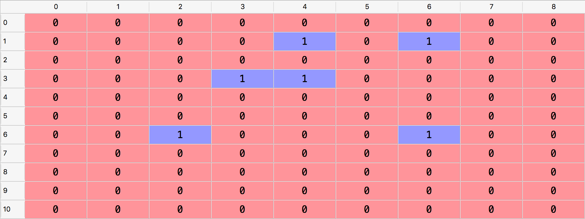
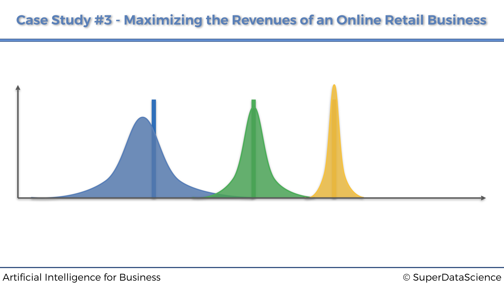
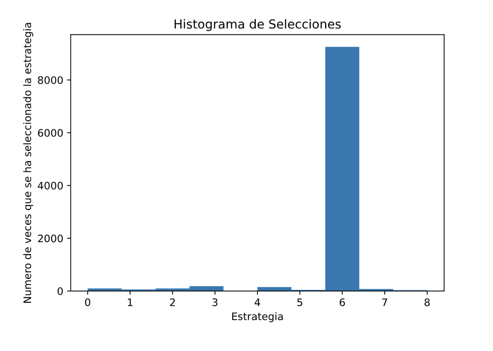

# Maximización de Beneficios Revenues

¡Felicidades por seguir el primer y segundo estudio de caso! Ahora pasemos a un tipo muy diferente de Inteligencia Artificial, que tiene una eficiencia tremenda para las empresas y negocios y que sin duda alguna debes conocer.

## Caso Práctico: Maximización de beeficios de un negocio de venta online en línea

### Problema a reesolver

Imagina un negocio minorista en línea que tiene millones de clientes. Estos clientes son solo personas que compran algunos productos en el sitio web de vez en cuando y se los entregan en casa (como Amazon). El negocio está funcionando bien, pero la junta directiva ha decidido tomar algún plan de acción para maximizar aún más los ingresos. Este plan consiste en ofrecer a los clientes la opción de suscribirse a un plan premium, que les dará algunos beneficios como precios reducidos, ofertas especiales, etc. Este plan premium se ofrece a un precio anual de 100 dólares y el objetivo de este negocio minorista en línea es, por supuesto, conseguir que el máximo de clientes se suscriba a este plan premium. Hagamos algunos cálculos rápidos para motivarnos a construir una IA para maximizar los ingresos de este negocio. Digamos que este negocio minorista en línea tiene 100 millones de clientes. Ahora consideremos dos estrategias de conversión que intentan convertir a los clientes al plan premium: una mala, con una tasa de conversión del 1%, y una buena, con una tasa de conversión del 11%. Si el negocio lleva a camo la estrategia mala, obtendrá en un año un ingreso extra total proveniente de la suscripción al plan premium de: $100.000.000 \times 0.01 \times 100 = 100.000.000\$$. Por otro lado, si el negocio implementa la buena estrategia, obtendrá en un año un ingreso extra total proveniente de la suscripción al plan premium de $100.000.000 \times 0.11 \times 100 = 1.100.000.000\$$. Por lo tanto, al descubrir la buena estrategia para implementar, el negocio maximizará sus ingresos adicionales al ganar más de mil millones de dólares adicionales.

En este ejemplo utópico anterior, solo teníamos dos estrategias, y además sabíamos sus tasas de conversión. Sin embargo, en nuestro caso práctico enfrentaremos 9 estrategias diferentes, y nuestra IA no tendrá idea de cuál es la mejor, y absolutamente ninguna información previa sobre ninguna de sus tasas de conversión. Sin embargo, asumiremos que cada una de estas 9 estrategias tiene una tasa de conversión fija. Estas estrategias fueron elaboradas de forma cuidadosa e inteligente por el equipo de marketing, y cada una de ellas tiene el mismo objetivo: convertir a los clientes máximos en el plan premium. Sin embargo, estas 9 estrategias son todas diferentes. Tienen diferentes formas, diferentes paquetes, diferentes anuncios y diferentes ofertas especiales para convencer y persuadir a los clientes a suscribirse al plan premium. Por supuesto, el equipo de marketing no tiene idea de cuál de estas 9 estrategias es la mejor. Pero quieren resolverlo lo antes posible y ahorrando los costes máximos, cuál tiene la tasa de conversión más alta, porque saben cómo encontrar e implementar esa mejor estrategia puede maximizar significativamente los ingresos. Además, los expertos en marketing optan por no enviar un correo electrónico a sus 100 millones de clientes, ya que sería costoso y correrían el riesgo de enviar spam a demasiados clientes. En su lugar, buscarán sutilmente esa mejor estrategia a través del aprendizaje en línea. ¿Qué es el aprendizaje en línea? Consistirá en implementar una estrategia cada vez que un cliente navegue por el sitio web de negocios minoristas en línea para pasar el rato o comprar algunos productos. Luego, mientras el cliente navega por el sitio web, de repente recibirá un anuncio emergente, sugiriéndole que se suscriba al plan premium. Y para cada cliente que navega por el sitio web, solo se implementará una de las 9 estrategias. Luego, el usuario elegirá, o no, tomar medidas y suscribirse al plan premium. Si el cliente se suscribe, es un éxito, de lo contrario, es un fracaso. Cuantos más clientes hagan esto, más comentarios recibiremos y mejor podremos tener una idea de cuál es la mejor estrategia. Pero, por supuesto, no lo resolveremos manualmente, visualmente o con algunas matemáticas simples. En cambio, queremos implementar el algoritmo más inteligente que descubra cuál es la mejor estrategia en el menor tiempo posible. Y eso es por las mismas dos razones: primero porque implementar cada estrategia tiene un coste (por ejemplo, proveniente del anuncio emergente en la web), y segundo porque la compañía quiere molestar a los clientes lo menos posible con su anuncio.

Resumamos las diferencias en las características de estas 9 estrategias simplemente de esta manera:


**Simulación**

Para simular este Caso Práctico, asumiremos que estas estrategias tienen las siguientes tasas de conversión:


Sin embargo, asegúrate de comprender que en una situación de la vida real **no tendríamos idea** de cuáles serían estas tasas de conversión. Solo las conocemos aquí para fines de simulación, solo para que podamos verificar al final que nuestra IA logra descubrir la mejor estrategia, que según la tabla anterior, es la estrategia número 7 (la que tiene la tasa de conversión más alta).

### Definición del Entorno

El aprendizaje en línea es una rama especial de la inteligencia artificial, donde no hay mucha necesidad de definir los estados y las acciones. Aquí, un estado sería simplemente un cliente específico en el que desplegaríamos una estrategia, y la acción sería simplemente la estrategia seleccionada. Luego lo verás más claro en el algoritmo de IA, donde no tenemos los estados como entradas y las acciones como salidas como en nuestros dos casos prácticos anteriores, porque esta vez no estamos haciendo Q-Learning o Deep Q-Learning. Aquí estamos haciendo aprendizaje en línea. Sin embargo, tenemos que definir las recompensas, ya que nuevamente tendremos que hacer una matriz de recompensas, donde cada fila corresponde a un usuario que está implementando una estrategia, y cada columna corresponde a una de las 9 estrategias. Por lo tanto, dado que realmente ejecutaremos este experimento de aprendizaje en línea en 10.000 clientes, esta matriz de recompensas tendrá 10.000 filas y 9 columnas. Luego, cada celda obtendrá un 0 si el cliente no se suscribe al plan premium después de ser abordado por la estrategia seleccionada, y un 1 si el cliente se suscribe después de ser abordado por la estrategia seleccionada. Y los valores en la celda son exactamente, las recompensas.

Ahora, una cosa muy importante para entender es que la matriz de recompensas solo está aquí para la simulación, y en la vida real no tendríamos una matriz de recompensas. Simplemente simularemos 10.000 clientes siendo abordados sucesivamente por una de las 9 estrategias, y gracias a la matriz de recompensas simularemos la decisión del cliente de suscribirse sí o no al plan premium. Si la celda correspondiente a un cliente específico y una estrategia seleccionada específica tiene un 1, eso simulará una conversión por parte del cliente al plan premium, y si la celda tiene un 0, simulará un rechazo. A continuación, como ejemplo, las primeras filas de una matriz de recompensas simulada:



De acuerdo con esta simulación, todo dado en la matriz de recompensas anterior:

1. El primer cliente (fila con índice 0) no se suscribirá al plan premium después de haber sido abordado por cualquier estrategia.
2. El segundo cliente (fila con índice 1) se suscribiría al plan premium después de ser abordado únicamente por la estrategia 5 o la estrategia 7.
3. El tercer cliente (fila con índice 2) no se suscribiría al plan premium después de haber sido abordado por cualquier estrategia.

El muestreo de Thompson recopilará los comentarios de si cada uno de estos clientes se suscribe al plan premium uno tras otro y, gracias a su poderoso algoritmo, descubrirá rápidamente la estrategia con la tasa de conversión más alta, esa es la mejor. para ser implementado en los millones de clientes, maximizando así los ingresos de la compañía de esta nueva fuente de ingresos.

## Solución de IA

La solución de IA que determinará la mejor estrategia se llama *muestreo de Thompson*. Es, con diferencia, el mejor modelo para ese tipo de problemas en esta rama de Aprendizaje en línea de Inteligencia Artificial. En resumen, cada vez que un nuevo cliente se conecta al sitio web de negocios minoristas en línea, esa es una nueva ronda $n$ y seleccionamos una de nuestras 9 estrategias para intentar una conversión (suscripción al plan premium). El objetivo es seleccionar la mejor estrategia en cada ronda, y entrenar durante muchas rondas. Así es como el muestreo de Thompson lo hará:

**Para cada ronda $n$, repetimos durante más de 1000 iteraciones, los siguientes tres pasos**:

**Paso 1** Para cada iteración $i$, se elige un valor aleatorio que siga la distribución:

$$\theta_i(n) \sim \beta(N_i^1(n)+1,N_i^0(n)+1)$$

donde:

+ $N_i^1(n)$ es el número de veces que la estrategia $i$-ésima ha recibido una recompensa igual a 1 hasta la ronda $n$-ésima,
+ $N_i^0(n)$ es el número de veces que la estrategia $i$-ésima ha recibido una recompensa igual a 0 hasta la ronda $n$-ésima.

**Paso 2** Seleccionamos la estrategia $s(n)$ que nos da el mayor valor$\theta_i(n)$:

$$s(n) = \underset{i\in\{1,...,9\}}{\textrm{argmax}}(\theta_i(n))$$

**Paso 3** Actualizamos $N_{s(n)}^1(n)$ y $N_{s(n)}^0(n)$ según las siguientes condiciones:
    
+ Si la estrategia seleccionada $s(n)$ tiene una recompensa igual a 1:
  
$$N_{s(n)}^1(n) := N_{s(n)}^1(n) + 1$$
    
+ Si la estrategia seleccionada $s(n)$ tiene una recompensa igual a 0:
  
$$N_{s(n)}^0(n) := N_{s(n)}^0(n) + 1$$

**Intuición.** Cada estrategia tiene su propia distribución beta. A lo largo de las rondas, la distribución beta de la estrategia con la tasa de conversión más alta se desplazará progresivamente hacia la derecha, y las distribuciones beta de las estrategias con tasas de conversión más bajas se desplazarán progresivamente hacia la izquierda (Pasos 1 y 3). Por lo tanto, debido al Paso 2, la estrategia con la tasa de conversión más alta se seleccionará por probabilidad cada vez más. A continuación se muestra un gráfico que muestra tres distribuciones beta de tres estrategias, que te ayudarán a visualizar este hecho:



## Implementación

Vamos a ver a continuación la implementación completa del muestreo de Thompson  para este caso práctico específico, siguiendo la misma simulación vista anteriormente.

Al implementar el muestreo de Thompson, también implementaremos el algoritmo de selección aleatoria, que simplemente seleccionará una estrategia aleatoria en cada ronda. Este será nuestro punto de referencia para evaluar el rendimiento de nuestro modelo de muestreo de Thompson. Por supuesto, el muestreo de Thompson y el algoritmo de selección aleatoria competirán en la misma simulación, es decir, utilizando la misma matriz de recompensas. Y al final, una vez realizada la simulación completa, evaluaremos el rendimiento de Thompson Sampling calculando el rendimiento relativo, definido por la siguiente fórmula:

$$\textrm{Rendimiento Rel.} = \frac{\textrm{(Rec. del m. de Thompson)} - (\textrm{Rec. de la sel. Aleatoria})}{\textrm{Recompensa de la s. Aleatoria}} \times 100$$

También representaremos el histograma de los anuncios seleccionados, solo para verificar que la estrategia con la tasa de conversión más alta (Estrategia 7) ha sido en efecto la más seleccionada.


Pues si estás listo, aquí vamos:

Primero, importamos las librerías necesarias y establecemos los parámetros ($N = 10000$ clientes y $d = 9$ estrategias):

```{python, eval=T}
# Inteligencia Artificial aplicada a Negocios y Empresas
# Maximizando los ingresos de un negocio minorista en línea con el muestreo de Thompson

# Importar las librerías
import numpy as np
import matplotlib.pyplot as plt
import random

# Configuración de parámetros
N = 10000
d = 9
```


Luego, creamos la simulación, construyendo la matriz de recompensas de 10000 filas correspondientes a los clientes, y 9 columnas correspondientes a las estrategias. En cada ronda y para cada estrategia, seleccionamos un número aleatorio entre 0 y 1, y si este número aleatorio es menor que la tasa de conversión de dicha estrategia, la recompensa será 1; de lo contrario, será 0. De esa manera simulamos las tasas de conversión enumeradas anteriormente para nuestras 9 estrategias:


```{python, eval=T}
# Creación de la simulación
conversion_rates = [0.05,0.13,0.09,0.16,0.11,0.04,0.20,0.08,0.01]
X = np.array(np.zeros([N,d]))
for i in range(N):
    for j in range(d):
        if np.random.rand() <= conversion_rates[j]:
            X[i,j] = 1
```

Luego, recorreremos las 10000 filas (o rondas) de esta matriz de recompensas, y en cada ronda obtendremos dos selecciones de estrategia separadas: una del algoritmo de Selección aleatoria y otra del muestreo de Thompson. Llevamos un registro de las estrategias seleccionadas por cada uno de estos dos algoritmos, y calculamos la recompensa total acumulada durante las rondas por cada uno de ellos. El muestreo de Thompson se implementa siguiendo exactamente los pasos 1, 2 y 3 proporcionados anteriormente:

```{python, eval=T}
# Implementación de la selección aleatoria y del muestreo de Thompson
strategies_selected_rs = []
strategies_selected_ts = []
total_reward_rs = 0
total_reward_ts = 0
numbers_of_rewards_1 = [0] * d
numbers_of_rewards_0 = [0] * d
for n in range(0, N):
    # Selección aleatoria
    strategy_rs = random.randrange(d)
    strategies_selected_rs.append(strategy_rs)
    reward_rs = X[n, strategy_rs]
    total_reward_rs = total_reward_rs + reward_rs
    # Muestreo de Thompson
    strategy_ts = 0
    max_random = 0
    for i in range(0, d):
        random_beta = random.betavariate(numbers_of_rewards_1[i] + 1,
                                         numbers_of_rewards_0[i] + 1)
        if random_beta > max_random:
            max_random = random_beta
            strategy_ts = i
    reward_ts = X[n, strategy_ts]
    if reward_ts == 1:
        numbers_of_rewards_1[strategy_ts] = numbers_of_rewards_1[strategy_ts] + 1
    else:
        numbers_of_rewards_0[strategy_ts] = numbers_of_rewards_0[strategy_ts] + 1
    strategies_selected_ts.append(strategy_ts)
    total_reward_ts = total_reward_ts + reward_ts
```

Luego calculamos resultado final, que es el rendimiento relativo del muestreo de Thompson con respecto a nuestro punto de referencia que es la selección aleatoria:

```{python, eval=F}
# Cálculo del rendimiento relativo
relative_return = (total_reward_ts - total_reward_rs) / total_reward_rs * 100
print("Rendimiento Relativo: {:.0f} %".format(relative_return))
```

Y prepárate, porque al ejecutar este código obtenemos un retorno relativo final, de ...:

```{python, eval=T, echo=F}
# Cálculo del rendimiento relativo
relative_return = (total_reward_ts - total_reward_rs) / total_reward_rs * 100
print("Rendimiento Relativo: {:.0f} %".format(relative_return))
```

En otras palabras, el muestreo de Thompson casi duplicó el rendimiento de nuestro punto de referencia de la selección aleatoria.

Y finalmente, representemos el histograma de las estrategias seleccionadas, para verificar que efectivamente la Estrategia 7 (la de índice 6) fue la más seleccionada por el algoritmo, ya que es la que tiene la tasa de conversión más alta:¡

```{python, eval=T}
# Representación del histograma de selecciones
plt.hist(strategies_selected_ts)
plt.title('Histograma de Selecciones')
plt.xlabel('Estrategia')
plt.ylabel('Numero de veces que se ha seleccionado la estrategia')
plt.show()
```


Al ejecutar este código final, obtenemos el siguiente histograma:



Y de hecho, es la estrategia del índice 6, es decir, la Estrategia 7, la que fue, con diferencia, la más seleccionada. El muestreo de Thompson ha sido capaz de identificarlo rápidamente. Y, de hecho, si volvemos a ejecutar el mismo código pero con solo 1000 clientes, nos damos cuenta de que el muestreo de Thompson  todavía puede identificar la Estrategia 7 como la mejor, con muchas menos pruebas.

En consecuencia, el muestreo de Thompson seguramente ha hecho un trabajo increíble para este negocio minorista en línea. Porque no solo ha sido capaz de identificar la mejor estrategia rápidamente en un número reducido de rondas, es decir, con solamente algunos clientes, lo que nos ha ahorrado mucho en publicidad y costes operativos. Pero también, por supuesto, ha sido capaz de descubrir claramente la estrategia con la tasa de conversión más alta. Y, de hecho, si este negocio minorista en línea tiene 100 millones de clientes, y si el plan premium tiene un precio de 100 dólares al año, la implementación de esta mejor estrategia que tiene una tasa de conversión del 20% conduciría a generar un ingreso adicional de ...:

$$\textrm{Ingresos extra generados} = 100000000 \times 0.2 \times 100 = \textrm{2 mil millones de }\$!!$$

En otras palabras, muestreo de Thompson maximizó clara y rápidamente los ingresos de este negocio minorista en línea, al mismo tiempo que ahorró mucho en los costos, maximizando así la rentabilidad del negocio.

**Curva del arrepentimiento.**

La curva de arrepentimiento de un modelo (con estrategia aleatoria o con el muestreo de Sampling) es la representación gráfica de la diferencia entre la mejor estrategia y el modelo desplegado, con respecto a las rondas.

La mejor estrategia se calcula simplemente obteniendo, en cada ronda, el máximo de las recompensas acumuladas sobre todas las diferentes estrategias. Por lo tanto, en nuestra implementación, obtendremos la mejor estrategia de la siguiente manera:

```{python, eval=T}
rewards_strategies = [0] * d
for n in range(0, N):
    # La mejor estrategia
    for i in range(0, d):
        rewards_strategies[i] = rewards_strategies[i] + X[n, i]
    total_reward_bs = max(rewards_strategies)
```

Entonces, el arrepentimiento del muestreo de Thompson se calcula simplemente como la diferencia entre la mejor estrategia y el modelo del muestreo de Thompson:

```{python, eval=T}
# Arrepentimiento del muestreo Thompson
strategies_selected_ts = []
total_reward_ts = 0
total_reward_bs = 0
numbers_of_rewards_1 = [0] * d
numbers_of_rewards_0 = [0] * d
rewards_strategies = [0] * d
regret = []
for n in range(0, N):
    # Muestreo de Thompson
    strategy_ts = 0
    max_random = 0
    for i in range(0, d):
        random_beta = random.betavariate(numbers_of_rewards_1[i] + 1,
                                         numbers_of_rewards_0[i] + 1)
        if random_beta > max_random:
            max_random = random_beta
            strategy_ts = i
    reward_ts = X[n, strategy_ts]
    if reward_ts == 1:
        numbers_of_rewards_1[strategy_ts] = numbers_of_rewards_1[strategy_ts] + 1
    else:
        numbers_of_rewards_0[strategy_ts] = numbers_of_rewards_0[strategy_ts] + 1
    strategies_selected_ts.append(strategy_ts)
    total_reward_ts = total_reward_ts + reward_ts
    # La mejor estrategia
    for i in range(0, d):
        rewards_strategies[i] = rewards_strategies[i] + X[n, i]
    total_reward_bs = max(rewards_strategies)
    # Arrepentimiento
    regret.append(total_reward_bs - total_reward_ts)
```

```{python, echo=F}
#Apaño para no perder el regret anterior
regret_old = regret
``` 

Y lo mismo, el arrepentimiento de la estrategia aleatoria simplemente se calcula como la diferencia entre la mejor estrategia y el algoritmo de selección aleatoria:

```{python, eval=T}
# Arrepentimiento de la estrategia aleatoria
strategies_selected_rs = []
total_reward_rs = 0
total_reward_bs = 0
numbers_of_rewards_1 = [0] * d
numbers_of_rewards_0 = [0] * d
rewards_strategies = [0] * d
regret = []
for n in range(0, N):
    # Estrategia aleatoria
    strategy_rs = random.randrange(d)
    strategies_selected_rs.append(strategy_rs)
    reward_rs = X[n, strategy_rs]
    total_reward_rs = total_reward_rs + reward_rs
    # La mejor estrategia
    for i in range(0, d):
        rewards_strategies[i] = rewards_strategies[i] + X[n, i]
    total_reward_bs = max(rewards_strategies)
    # Arrepentimiento
    regret.append(total_reward_bs - total_reward_rs)
```

Y finalmente, por supuesto, representamos el arrepentimiento sobre las rondas con este simple código (no tenemos que especificar las coordenadas x en la función `plt.plot()` porque las rondas ya son índices desde 0 hasta N):

```{python, eval=F}
# Representación de la curva de arrepentimiento
plt.plot(regret)
plt.title('Curva de Arrepentimiento')
plt.xlabel('Ronda')
plt.ylabel('Arrepentimiento')
plt.show()
```

Si representamos la curva de arrepentimiento de la estrategia aleatoria, obtenemos lo siguiente:

```{python, eval=T, echo=F}
# Representación de la curva de arrepentimiento
plt.plot(regret)
plt.title('Curva de Arrepentimiento - Seleccion Aleatoria')
plt.xlabel('Ronda')
plt.ylabel('Arrepentimiento')
plt.show()
```

Y, por supuesto, no observamos absolutamente ninguna convergencia de la estrategia aleatoria hacia la mejor estrategia.

Sin embargo, si ahora representamos la curva de arrepentimiento del modelo de muestreo de Thompson, obtenemos la siguiente curva hermosa:

```{python, eval=T, echo=F}
# Representación de la curva de arrepentimiento
plt.plot(regret_old)
plt.title('Curva de Arrepentimiento - Muestreo de Thompson')
plt.xlabel('Ronda')
plt.ylabel('Arrepentimiento')
plt.show()
```
Y obviamente, el muestreo de Thompson está convergiendo muy bien hacia la mejor estrategia.

Finalmente, aquí está el código final que incluye esa Curva de arrepentimiento del muestreo de Thompson:

```{python, eval=F}
# Muestreo de Thompson

# Importar las librerías
import numpy as np
import matplotlib.pyplot as plt
import random

# Configuración de los parámetros
N = 10000
d = 9

# Creación de la simulación
conversion_rates = [0.05,0.13,0.09,0.16,0.11,0.04,0.20,0.08,0.01]
X = np.array(np.zeros([N,d]))
for i in range(N):
    for j in range(d):
        if np.random.rand() <= conversion_rates[j]:
            X[i,j] = 1

# Implementación de la estrategia aleatoria y del muestreo de Thompson con la curva de arrepentimiento
strategies_selected_rs = []
strategies_selected_ts = []
total_reward_rs = 0
total_reward_ts = 0
total_reward_bs = 0
numbers_of_rewards_1 = [0] * d
numbers_of_rewards_0 = [0] * d
rewards_strategies = [0] * d
regret = []
for n in range(0, N):
    # Estrategia aleatoria
    strategy_rs = random.randrange(d)
    strategies_selected_rs.append(strategy_rs)
    reward_rs = X[n, strategy_rs]
    total_reward_rs = total_reward_rs + reward_rs
    # Muestreo de Thompson
    strategy_ts = 0
    max_random = 0
    for i in range(0, d):
        random_beta = random.betavariate(numbers_of_rewards_1[i] + 1,
                                         numbers_of_rewards_0[i] + 1)
        if random_beta > max_random:
            max_random = random_beta
            strategy_ts = i
    reward_ts = X[n, strategy_ts]
    if reward_ts == 1:
        numbers_of_rewards_1[strategy_ts] = numbers_of_rewards_1[strategy_ts] + 1
    else:
        numbers_of_rewards_0[strategy_ts] = numbers_of_rewards_0[strategy_ts] + 1
    strategies_selected_ts.append(strategy_ts)
    total_reward_ts = total_reward_ts + reward_ts
    # La mejor estrategia
    for i in range(0, d):
        rewards_strategies[i] = rewards_strategies[i] + X[n, i]
    total_reward_bs = max(rewards_strategies)
    # Arrepentimiento
    regret.append(total_reward_bs - total_reward_ts)

# Calcular el rendimiento absoluto y relativo
absolute_return = total_reward_ts - total_reward_rs
relative_return = (total_reward_ts - total_reward_rs) / total_reward_rs * 100
print("Rendimiento Absoluto: {:.0f} $".format(absolute_return))
print("Rendimiento Relativo: {:.0f} %".format(relative_return))

# Representación de los histogramas de selecciones
plt.hist(strategies_selected_ts)
plt.title('Histograma de Selecciones')
plt.xlabel('Estrategia')
plt.ylabel('Numero de veces que la estrategia ha sido seleccionada')
plt.show()
plt.close()

# Representación de la curva de arrepentimiento
plt.plot(regret)
plt.title('Curva de Arrepentimiento')
plt.xlabel('Ronda')
plt.ylabel('Arrepentimiento')
plt.show()
```
