# Anexos adicionales
## Anexo 1: Redes Neuronales Artificiales

En este apartado Anexo, encontrarás toda la teoría necesaria de Redes Neuronales Artificiales, que son el apartado principal del modelo de Deep Q-Learning model que hemos creado en la Parte 2 - Minimización de Costes. Este es el plan de ataque que seguiremos para estudiar acerca de las Redes Neuronales Artificiales:

* La Neurona
* La Función de Activación
* ¿Cómo funcionan las Redes Neuronales?
* ¿Cómo aprenden las Redes Neuronales?
* Propagación hacia adelante and Propagación hacia atrás
* Gradiente Descendente
* Gradiente Descendente por bloques y Gradiente Descendente Estocástico

### La Neurona

La neurona es el bloque de construcción básico de las redes neuronales artificiales. En las siguientes imágenes se muestran neuronas reales de la vida real que se han colocado sobre un vidrio, coloreadas un poco con tinte y observadas con un microscopio:


Como podemos ver, tienen la estructura de un cuerpo con muchas ramas diferentes que salen de ellos. Pero la pregunta es: ¿cómo podemos recrear esta estructura en una máquina? De hecho, realmente necesitamos recrearlo en un ordenador, ya que el objetivo de Deep Learning es imitar cómo funciona el cerebro humano, con la esperanza de que al hacerlo creemos algo increíble: una infraestructura poderosa para que las máquinas puedan aprender.

¿Por qué esperamos eso? Porque el cerebro humano resulta ser una de las herramientas de aprendizaje más poderosas del planeta. Así que solo esperamos que si lo recreamos, tendremos algo tan increíble como eso. Entonces, este será nuestro desafío en este momento, este es nuestro primer paso para crear Redes Neuronales Artificiales: ser capaces de recrear una neurona.

Entonces, ¿cómo lo hacemos? Bueno, antes que nada echemos un vistazo más de cerca a lo que realmente es una neurona. La imagen a continuación fue creada por primera vez por un neurocientífico español Santiago Ramón y Cajal en 1899:


Este neurocientífico tiñó neuronas en el tejido cerebral real y las observó con un microscopio. Mientras los miraba, dibujó lo que vio, que es exactamente lo que vemos en la imagen de arriba. Hoy en día, la tecnología ha avanzado bastante permitiéndonos ver las neuronas mucho más cerca con más detalle para que podamos dibujar lo que parece en forma de diagrama.

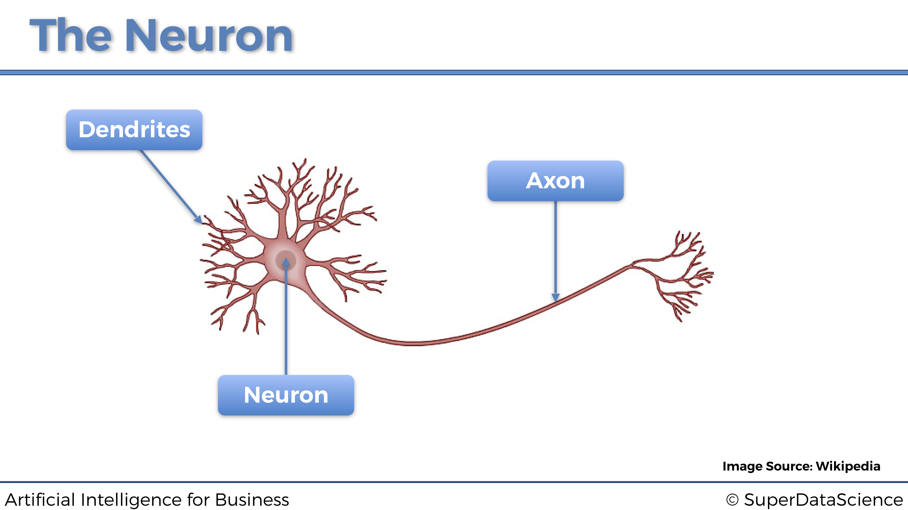


Esto es una neurona. Esta neurona intercambia señales con sus neuronas vecinas. Las dendritas son los receptores de la señal y el axón es el transmisor de la señal. Aquí hay una imagen de cómo funciona todo conceptualmente:


Podemos ver que las dendritas de la neurona están conectadas a los axones de otras neuronas por encima. Luego, la señal viaja por su axón y pasa a las dendritas de la siguiente neurona. Así es como están conectados y cómo funciona una neurona. Por lo tanto, ahora es el momento de pasar de la neurociencia a la tecnología.

Así es como se representa una neurona dentro de una red neuronal artificial:


Al igual que una neurona humana, recibe algunas señales de entrada y tiene una señal de salida. La flecha azul que conecta las señales de entrada a la neurona, y la neurona a la señal de salida, son como las sinapsis en la neurona humana. Pero aquí, en la neurona de la máquina, ¿cuáles serán exactamente estas señales de entrada y salida? Bueno, las señales de entrada serán las variables independientes escaladas que componen los estados del entorno, que recordemos en el caso práctico que nos ocupa son la temperatura del servidor, el número de usuarios y la velocidad de transmisión de datos, y la señal de salida será los valores de salida, que en el modelo de Deep Q-Learning son siempre los Q-Values. Por lo tanto, obtenemos la representación general de una neurona para ordenadores:


Y ahora para terminar con la neurona, agreguemos los últimos elementos que faltan en esta representación, pero también los más importantes: los pesos. A cada sinapsis (flecha azul) se le atribuirá un peso. Cuanto mayor sea el peso, más fuerte será la señal a través de la sinapsis. Y lo que es fundamental entender es que, estos pesos, serán lo que la máquina actualizará y actualizará con el tiempo para mejorar las predicciones. Veámoslo en el gráfico anterior, para asegurarnos de que los visualizamos correctamente antes de seguir:


### La Función de Activación

La función de activación es la función $\phi$ que opera dentro de la neurona, que tomará como entradas la combinación lineal de los valores de entrada multiplicados por sus pesos asociados, y sumados entre si y que devolverá el valor de salida:


calculado como

$$y = \phi\left( \sum_{i=1}^m w_i x_i \right)$$

¿Cuál será exactamente la función $\phi$?


Puede haber muchas de ellos, diferentes pero vamos a ver aquí los cuatro más usados, incluido, por supuesto, el que usamos en la Parte 2: Minimización de costos:

* La función de activación de umbral
* La función de activación sigmoidea
* La función de activación del rectificador
* La función de activación de la tangente hiperbólica

Vamos a verlas todas una por una:

#### La función de activación de umbral

La función de activación de umbral, también llamada función escalón, se define simplemente como:

$$
\phi(x) =
    \begin{cases}
        1 \textrm{ si } x \ge 0 \\
        0 \textrm{ si } x < 0
    \end{cases}
$$

de modo que su representación gráfica es: 


Esto significa que la señal que pasa por la neurona será discontinua, y solo se activará si:

$$\sum_{i=1}^m w_i x_i \ge 0$$

#### La función de activación sigmoidea

Ahora echemos un vistazo a la siguiente función de activación: la función de activación sigmoidea.

La función de activación sigmoidea es la más efectiva y ampliamente utilizada en Redes Neuronales Artificiales, pero principalmente dentro de la última capa oculta (si se trata de una red neuronal profunda compuesta de varias capas ocultas) que pasa la señal hacia la capa de salida.

La función de activación sigmoidea se define como:

$$\phi(x) = \frac{1}{1+e^{-x}}$$

y da como resultado la siguiente representación gráfica:

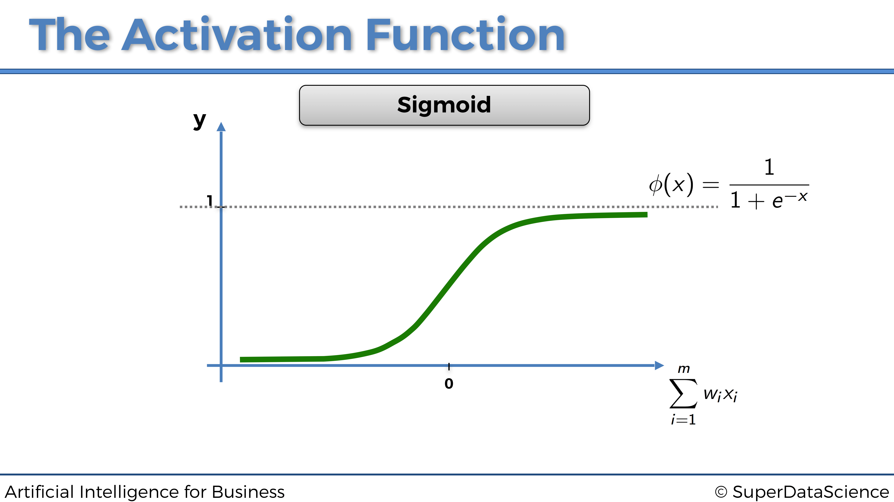

Esto significa que la señal que pasa por la neurona será continua y siempre se activará. Y cuanto mayor sea $\sum_{i = 1}^m w_i x_i$, más fuerte será esa señal.

#### La función de activación rectificadora

Ahora echemos un vistazo a otra función de activación ampliamente utilizada: la función de activación rectificadora.

La solemos encontrar en la mayoría de las redes neuronales **profundas**, pero sobretodo dentro de las capas ocultas, a diferencia de la función sigmoidea que se usa más bien para la capa de salida.

La función de activación rectificadora se define simplemente como:

$$\phi(x) = \max(x,0)$$

de modo que nos da lugar a la siguiente representación gráfica:


Esto significa que la señal que pasa por la neurona será continua y solo se activará si:

$$\sum_{i=1}^m w_i x_i \ge 0$$

Y como mayor sea $\sum_{i=1}^m w_i x_i$ por encima de 0, más fuerte será la señal transmitida.

#### La función de activación de la tangente hiperbólica

Ahora echemos un vistazo a la siguiente función de activación: la función de activación de la tangente hiperbólica.

La función de activación de la tangente hiperbólica es la menos utilizada, aunque a veces puede ser una opción más relevante en algunas Redes Neuronales Artificiales, especialmente cuando las entradas están estandarizadas.

La función de activación de la tangente hiperbólica se define por lo siguiente:

$$\phi(x) = \frac{1-e^{-2x}}{1+e^{-2x}}$$

de modo que da lugar a la siguiente: 

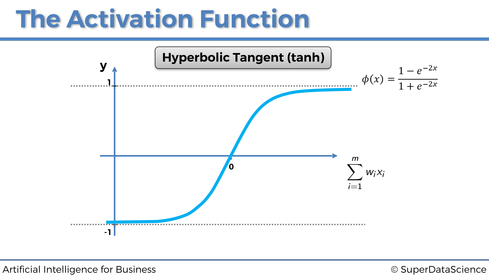

Esto significa que la señal que pasa por la neurona será continua y siempre se activará. Cuanto más el valor de $\sum_{i = 1}^m w_i x_i$ está por encima de 0, más fuerte será esa señal. Cuanto menos el valor de $\sum_{i = 1}^m w_i x_i$ está por debajo de 0, más débil será esa señal.

Eso plantea la pregunta: ¿qué función de activación deberíamos elegir? O también la pregunta que más me suelen hacer, ¿cómo sabemos cuál elegir?

Buenas noticias, la respuesta es simple, y vamos a verlo dentro de un pequeño algoritmo.

Eso realmente depende de lo que se devuelve como la variable dependiente. Si es un resultado binario 0 o 1, entonces una mejor opción sería la función de activación del umbral. Si lo que desea que se devuelva es la probabilidad de que la variable dependiente sea 1, entonces una opción excelente es la función de activación sigmoidea, ya que su curva sigmoidea se ajusta perfectamente a las probabilidades del modelo.

Aquí está este pequeño detalle resaltado en esta imagen:

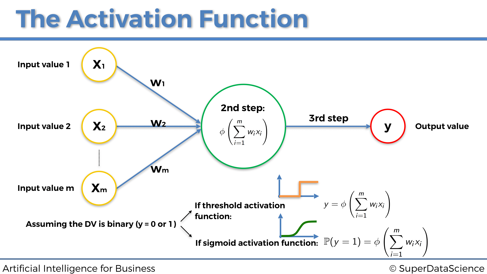

Pero entonces, ¿cuándo debo usar las otras dos funciones de activación, es decir, la función de activación del rectificador y la función de activación de la tangente hiperbólica?


Nuevamente, las funciones de activación rectificador y tangente hiperbólica deben usarse dentro de las capas ocultas de una Red neuronal profunda (con más de una capa oculta), excepto en la última capa oculta que conduce a la capa de salida para la cual se recomienda usar un función de activación sigmoidea.

Recapitulemos esto nuevamente dentro de la siguiente imagen:


Y, por último, ¿cómo elegir entre la función de activación del rectificador y la función de activación de la tangente hiperbólica en las capas ocultas? Pues es recomendable considerar usar la función de activación del rectificador cuando las entradas están normalizadas (escaladas entre 0 y 1), y la función de activación de Tangente hiperbólica cuando las entradas están estandarizadas (escaladas entre -1 y +1):

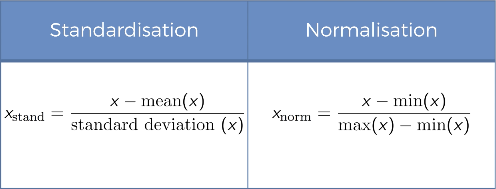


Ahora pasemos a la siguiente sección para explicar cómo funcionan las redes neuronales.

### ¿Cómo funcionan las Redes Neuronales?

Para explicar esto, consideremos el problema de predecir los precios inmobiliarios. Tenemos algunas variables independientes que vamos a utilizar para predecir el precio de casas y apartamentos. Para simplificar, y para poder representar todo en un gráfico, digamos que nuestras variables independientes (nuestros predictores) son las siguientes:

* Área (pies cuadrados) 
* Número de habitaciones 
* Distancia a la ciudad (Millas) 
* Edad

Entonces, nuestra variable dependiente es, por supuesto, el precio del apartamento para predecir.

A cada una de las variables independientes se le atribuye un peso, de tal manera que cuanto mayor sea el peso, mayor será el efecto que tendrá la variable independiente en la variable dependiente, es decir, el predictor más fuerte será de la variable dependiente. Por lo tanto, tan pronto como nuevas entradas ingresen a la red neuronal, las señales se propagarán hacia adelante desde cada una de las entradas, llegando a la neuronas de la capa oculta. Luego, dentro de cada neurona de la capa oculta, se aplicará la función de activación, de modo que cuanto menor sea el peso de la entrada, la función de activación más bloqueará la señal procedente de esa entrada y cuanto mayor será el peso de esa entrada, la función de activación más permitirá que pase la señal a través de ella. Y finalmente, todas las señales procedentes de las neuronas ocultas, más o menos bloqueadas por las funciones de activación resppectivas, se propagan hacia la capa de salida, para devolver el resultado final, es decir, la predicción del precio.

Representemos esto en el siguiente gráfico:


### ¿Cómo aprenden las Redes Neuronales?

En pocas palabras, las redes neuronales aprenden actualizando, durante muchas iteraciones llamadas `epochs`, los pesos de todas las entradas y neuronas ocultas (cuando tienen varias capas ocultas), hacia siempre el mismo objetivo: el de reducir el error de pérdida entre las predicciones y los valores reales.

De hecho, para que las Redes Neurales aprendan, necesitamos los valores reales, que también se denominan objetivos. En nuestro ejemplo anterior sobre la fijación de precios inmobiliarios, los valores reales son los precios reales de las casas y apartamentos en ventas. Estos precios reales dependen de las variables independientes enumeradas anteriormente (área, número de habitaciones, distancia a la ciudad y edad), y la red neuronal aprenderá a hacer mejores predicciones de estos precios, ejecutando el siguiente proceso:

* La red neuronal primero propaga las señales procedentes de las variables independientes de entrada $x_1$, $x_2$, $x_3$ y $x_4$.
* Luego obtiene el precio predicho $\hat{y}$ en la capa de salida.    
* Luego calcula el error de pérdida $C$ entre el precio predicho $\hat{y}$ (predicción) y el precio real $y$ (objetivo):    

$$C = \frac{1}{2} (\hat{y} - y)^2$$

* Luego, este error de pérdida se propaga hacia atrás dentro de la red neuronal, de derecha a izquierda en nuestra representación.    
* Luego, en cada una de las neuronas, la red neuronal ejecuta una técnica llamada Gradiente Descendente (que discutiremos en la siguiente sección), para actualizar los pesos en la dirección de reducción de pérdidas, es decir, en nuevos pesos que reducen el error de pérdida $C$.    
* Luego, todo este proceso se repite muchas veces, con cada vez nuevas entradas y nuevos objetivos, hasta que obtenemos el rendimiento deseado (detención temprana o *early stopping*) o la última iteración (número de iteraciones elegidas en la implementación).

Representemos las dos fases principales, Propagación hacia adelante y Propagación hacia atrás, de todo este proceso en los dos gráficos siguientes:

### Propagación hacia adelante and propagación hacia atrás

**Fase 1: Propagación hacia adelante:**

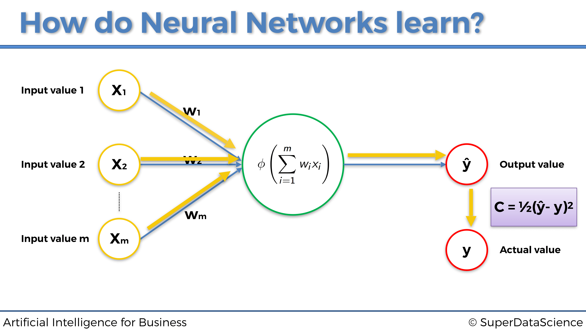

**Fase 2: Propagación hacia atrás:**

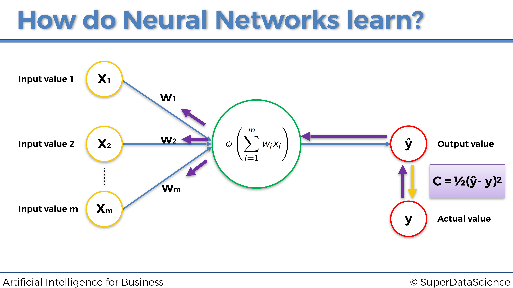

### Gradiente Descendente

#### Introducción al Gradiente Descendente

Cuando las personas hablan de Machine Learning o Deep Learning, hablan principalmente de los algoritmos que se utilizan. Pero las preguntas reales son, ¿por qué se considera que esos algoritmos son algoritmos de Aprendizaje automático o Aprendizaje profundo y otros no? ¿Cuál es la técnica subyacente que los diferencia?

La respuesta a la primera pregunta es bastante intuitiva: se considera que esos algoritmos aprenden sus parámetros por sí mismos. Esta propiedad no era muy común antes y la mayoría de los algoritmos fueron ajustados a mano por ingenieros para lograr una especificación / meta requerida.

Pero entonces apareció la idea de incorporar el Gradiente Descendente a los mismos y la mayoría de los algoritmos que no funcionaban antes, de repente tuvieron sentido y comenzaron a optimizarse.

Entonces, ¿es mágica la técnica del Gradiente Descendente? Bueno, para alguien lo podría ser, pero para nosotros es un algoritmo matemático que se utiliza para optimizar un modelo que tiene sus parámetros internos (pesos). O, para ser más técnicos, veamos qué dice Wikipedia al respecto:

>"El Gradiente Descendente es un algoritmo de optimización iterativa de primer orden para encontrar el mínimo de una función".


Esa es una definición correcta pero con poco contenido, y para alguien que recién está comenzando, ¡encima es aterradora! Vamos a desglosarlo:

* **Algoritmo**: en pocas palabras, es un plan sobre cómo resolver un problema. El ejemplo cotidiano de un algoritmo sería una receta de cocina.
* **Iterativo**: esto significa que utiliza algún tipo de bucle (para programadores, bucles `for` o `while`) para realizar pasos. Cada paso usa valores calculados previamente como entrada para el paso actual. Ahora, surge una pregunta: "¿Cuál es nuestro valor inicial?". Responderemos sobre esto un poco más adelante a través de ejemplos.
* **Optimización**: intenta encontrar las mejores soluciones de acuerdo con algunos criterios que conducen a varias soluciones alternativas, pero solo una se considera la mejor.
* **De primer orden** ElGradiente Descendente está utilizando la primera derivada de una función de criterio elegida (coste, pérdida) para encontrar cuál es una mejor solución para el problema dado.

Por lo tanto, cuando lo ponemos todo junto en palabras inteligibles, obtenemos la siguiente definición:

>El Gradiente Descendente es un plan sobre cómo encontrar la mejor solución para un problema donde más de una solución es aceptable. Utiliza un objetivo para determinar qué tan lejos estamos de encontrar la mejor solución.

Hasta este punto, tenemos todo aclarado, excepto la función de costes.

El coste es el indicador que seguimos durante el proceso de optimización. En base a ese indicador, podemos decir qué tan lejos estamos del óptimo de una función. Un buen ejemplo del costo es el error cuadrático medio, que hemos visto anteriormente en este libro:

$$\textrm{MSE} = \frac{1}{n} \sum_{i=1}^n (y_i - \hat{y}_i)$$

donde:

$$    
\begin{cases}
        \textrm{$\hat{y}_i$ es la predicción del modelo} \\
        \textrm{$y_i$ es el objetivo (el valor actual)} \\
        \textrm{$n$ es el número de muestras del data set}
    \end{cases}
$$

Cada algoritmo que utiliza el Gradiente Descendente como técnica de optimización tiene parámetros (pesos) que cambian durante el proceso de optimización. Cuando decimos que estamos buscando el mínimo de la función de pérdida, en realidad queremos decir que estamos buscando los valores de los pesos para los cuales la pérdida tiene el valor más bajo posible.

En consecuencia, para responder a nuestra segunda pregunta desde el principio, el punto en común que tienen todos los algoritmos de Aprendizaje automático desde la regresión lineal a las redes neuronales más complicadas es, de hecho, el Gradiente Descendente.

#### Idea del Gradiente Descendente

Como hemos visto, el Gradiente Descendente es una técnica de optimización que nos ayuda a encontrar el mínimo de una función de costo. Ahora visualicémoslo de la manera más intuitiva, como la siguiente bola en un bol (junro con un poco de espray matemático encima):


Imagina que esta es una sección transversal de un bol, dentro del cual dejamos caer una pequeña bola roja y dejamos que llegue al fondo del mismo Después de un tiempo dejará de rodar, ya que ha encontrado el punto ideal para ello, en el fondo del tazón.

Puedes pensar en el Gradiente Descendente de la misma manera. Comienza en algún lugar del bol (valores iniciales de los parámetros) e intenta encontrar el fondo del mismo, o en otras palabras, el mínimo de una función de coste.

Veamos el ejemplo que se muestra en la imagen de arriba. Los valores iniciales de los parámetros han establecido nuestra bola en la posición que se muestra. En base a eso obtenemos algunas predicciones, que comparamos con nuestros valores objetivo. La diferencia entre estos dos conjuntos será nuestra pérdida para el conjunto actual de parámetros.

Luego calculamos la primera derivada de la función de coste, con respecto a los parámetros. De aquí proviene el nombre **Gradient**. Aquí, esta primera derivada nos da la pendiente de la tangente a la curva donde está la bola. Si la pendiente es negativa, como en la imagen de arriba, damos el siguiente paso hacia el lado derecho. Si la pendiente es positiva, damos el siguiente paso hacia el lado izquierdo.

El nombre **Descendente** proviene del hecho de que siempre damos el siguiente paso que apunta hacia abajo, como se representa en el siguiente gráfico:

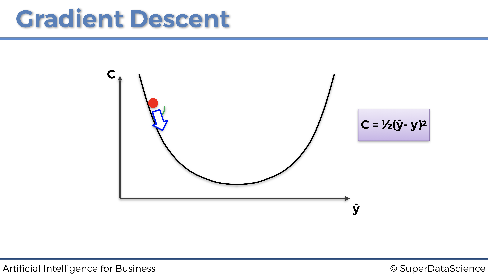


Ahora, en esta posición, nuestra pelota tiene una pendiente positiva, por lo que debemos dar el siguiente paso hacia la izquierda.

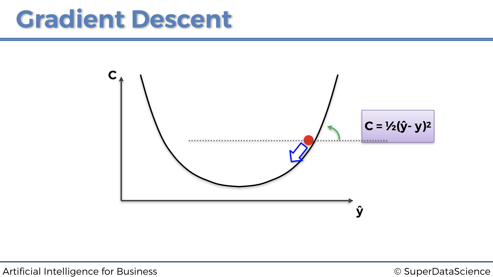

Eventualmente, al repetir los mismos pasos, la pelota terminará en el fondo del bol:


¡Y eso es! Así es como el Gradiente Descendente opera en una dimensión (un parámetro). Ahora puedes preguntarte: 

> Genial, pero ¿cómo funciona esto a gran escala? Hemos visto un ejemplo de optimización unidimensional, ¿qué pasa con dos o incluso 3 dimensiones?

Buena pregunta. El Gradiente Descendente garantiza que este enfoque se escala en tantas dimensiones como sea necesario, siempre que la función de costo sea convexa. De hecho, si la función de costo es convexa, el Gradiente Descendente encontrará siempre el mínimo **absoluto** de la función de costo. A continuación se muestra un ejemplo en 2 dimensiones:


Sin embargo, si la función de coste no es convexa, solo encontrará un mínimo **local**. A continuación se muestra un ejemplo en 3 dimensiones:


Ahora que entendemos de qué se trata el gradiente descendente, es hora de estudiar las versiones más avanzadas y efectivas....

* Gradiente Descendente en bloques
* Mini-Batch Gradiente Descendente
* Stochastic Gradiente Descendente


#### Gradiente Descendente en bloques

"Gradiente Descendente", "Gradiente Descendente en Bloques", "Gradiente Descendente Mini Batch", "Gradiente Descendente Estocástico".. Hay tantos términos y alguien que justo comienza a meterse en este mundillo puede encontrarlo muy confuso

La principal diferencia en todas estas versiones de Gradiente Descendente es la forma en que subministramos nuestros datos a un modelo y la frecuencia con la que actualizamos nuestros parámetros (pesos) para mover nuestra pequeña bola roja. Comencemos explicando el Gradiente Descendente en bloques.

Gradiente descendente en bloques es exactamente lo que hicimos en la Parte 2: Minimización de costes, donde recordemos que teníamos un lote de entradas que alimentaban la red neuronal, propagándolas hacia adelante para obtener al final un lote de predicciones, que a su vez se comparan con un lote de objetivos. El error de pérdida global entre las predicciones y los objetivos de los dos lotes se calcula como la suma de los errores de pérdida entre cada predicción y su objetivo asociado. Esa pérdida global se propaga nuevamente a la red neuronal, donde se realiza Gradiente Descendente o Gradiente Descendente estocástico para actualizar todos los pesos, de acuerdo con cómo fueron de responsables de ese error de pérdida global.

En la siguiente página a continuación hay un ejemplo de gradiente descendente en bloques. El problema a resolver es predecir la nota (de 0 a 100%) que los estudiantes obtienen en un examen, en función del tiempo dedicado a estudiar y el tiempo dedicado a dormir:


Una cosa importante a tener en cuenta en este gráfico anterior es que estas no son redes neuronales múltiples, sino una sola representada por actualizaciones de peso separadas. Y nuevamente, como podemos notar que en este ejemplo de Gradiente Descendente en bloques, alimentamos todos nuestros datos al modelo a la vez. Esto producirá actualizaciones colectivas de los pesos y una rápida optimización de la red. Sin embargo, también está el lado malo de esto. Existe una vez más la posibilidad de quedarse atascado en un mínimo local, como podemos ver en el siguiente gráfico a continuación:


La razón por la que esto sucede se ha explicado un poco antes: es porque la función de coste en el gráfico anterior no es convexa. Y este tipo de optimización (Gradiente Descendente simple) requiere que la función de costo sea convexa. Si ese no es el caso, podemos encontrarnos atrapados en un mínimo local y nunca encontrar el mínimo global que tenga los parámetros óptimos. Por otro lado, a continuación se muestra un ejemplo de una función de coste convexa, la misma que vimos anteriormente:


En pocas palabras, una función es convexa si solo tiene un mínimo global. Y el gráfico de una función convexa tiene la forma del bol.

Sin embargo, en la mayoría de los problemas, incluidos los problemas comerciales, la función de coste no será convexa (como en este mismo ejemplo gráfico en 3D a continuación), por lo que no permite que Gradiente Descendente funcione correctamente. Aquí es donde entra en juego el Gradiente Descendente Estocástico.


#### Gradiente Descendente Estocástico

Gradiente Descendente Estocástico (SGD) viene a salvarnos de la catástrofe anterior. De hecho, proporciona mejores resultados en general, evitando que el algoritmo se atasque en un mínimo local. Sin embargo, como su nombre lo indica, es estocástico, o en otras palabras, aleatorio. Debido a esta propiedad, no importa cuántas veces ejecutemos el algoritmo, el proceso siempre será ligeramente diferente. Y eso, independientemente de la inicialización.

El Gradiente Descendente Estocástico no se ejecuta sobre todo el conjunto de datos a la vez, sino que se introducen las entradas una a una. Por lo tanto, el proceso es así:

1. Se introduce una sola observación
2. Se obtiene una única predicción
3. Se calcula el error de pérdida entre la predicción y el objetivo
4. Se vuelve a propagar el error de pérdida en la red neuronal
5. Se actualizan los pesos con Gradiente Descendente
6. Se repiten los pasos 1. a 5. a través de todo el conjunto de datos

Representemos las tres primeras iteraciones en las tres primeras entradas individuales para este mismo ejemplo dado anteriormente sobre la predicción de las puntuaciones en un examen:

**Primera fila de entrada de observación**:


**Segunda fila de entrada de observación**:


**Tercera fila de entrada de observación**:


Cada uno de los tres gráficos anteriores es un ejemplo de una actualización de pesos ejecutada por el Gradiente Descendente Estocástico. Como podemos ver, cada vez introducimos una sola fila de observación desde nuestro conjunto de datos a la red neuronal, luego actualizamos los pesos en consecuencia y procedemos a la siguiente fila de entrada de observación.

A primera vista, el gradiente descendente estocástico parece más lento, porque introducimos cada fila por separado. Pero en realidad, es mucho más rápido debido al hecho de que no tenemos que cargar todo el conjunto de datos en la memoria, ni esperar a que todo el conjunto de datos pase por el modelo actualizando los pesos.

Para finalizar esta sección, repasemos la diferencia entre  gradiente descendente en bloque y gradiente descendente estocástico, con el siguiente gráfico:

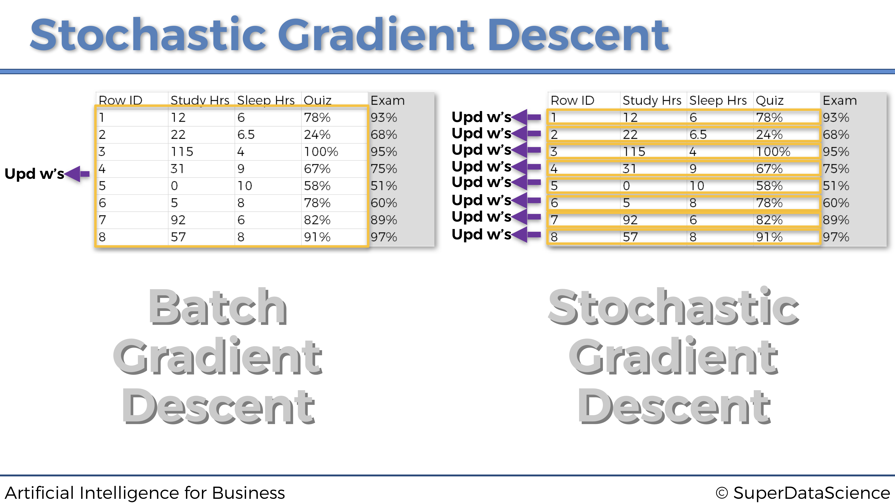

#### Gradiente Descendente Mini-Batch

El Gradiente Descendente Mini-Batchutiliza lo mejor de ambos mundos para combinar gradiente descendente en bloques con el dradiente descendente estocástico. Esto se hace alimentando la red neuronal con lotes de datos en lugar de alimentar filas de observaciones individuales una por una o todo el conjunto de datos a la vez.

Este enfoque es más rápido que el Gradiente Descendente Estocástico clásico y evita que se atasque en un mínimo local. Esto también ayuda cuando las personas no tienen suficientes recursos informáticos para cargar todo el conjunto de datos en la memoria, o suficiente potencia de procesamiento para obtener el beneficio completo del Gradiente Descendente Estocástico.

### Optimizadores

El optimizador es exactamente la herramienta que actualizará los pesos de la red neuronal a través del gradiente estocástico descendente. Hasta este punto, solo hemos mencionado el optimizador Adam (consulta la Parte 2: Minimización de costos), que es el optimizador más común utilizado para los modelos de Aprendizaje profundo y Aprendizaje por refuerzo profundo. Sin embargo, hay muchos más optimizadores que tienen sus propios beneficios y aplicaciones.

Veamos los optimizadores de gradiente descendente más famosos y ampliamente utilizados.

#### Optimizador Momentum

El Gradiente Descendente Estocástico clásico tiene oscilaciones muy grandes, lo que deja margen de mejora. El optimizador Momentum (también llamado optimizador de impulso) maneja estas grandes oscilaciones agregando fracciones de las direcciones calculadas en el paso anterior al paso actual. Esto amplifica la velocidad de la actualización de dirección actual. En el gráfico a continuación podemos ver y comparar el SGD clásico y el SGD Momentum en acción:

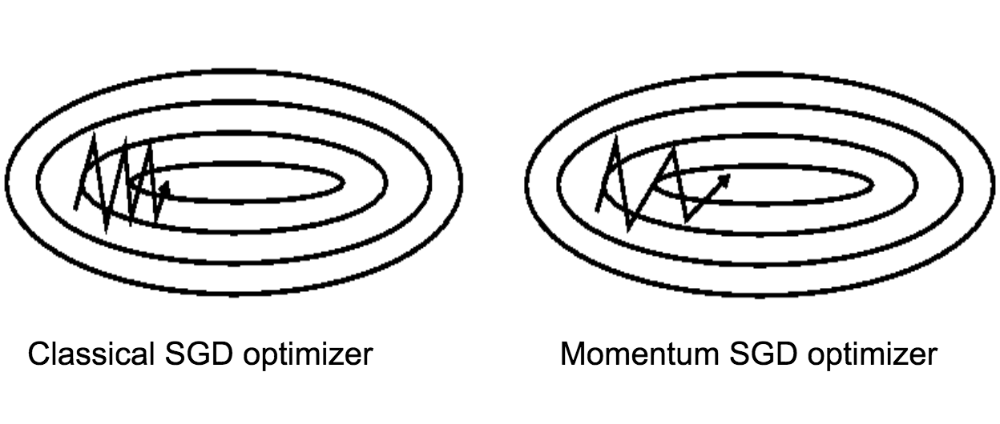

Los beneficios de optimizador Momentum son los siguientes:

* Convergencia más rápida
* Menos oscilaciones

Pero el optimizador Momentum también tiene inconvenientes, que son los siguientes:

* Tendencia a sobrepasar el mínimo global de la función de coste debido al impulso.
* Menos frecuente en las librerías de Deep Learning, lo que requiere el conocimiento adicional de programación para su implementación.

#### El optimizador de gradiente acelerado de Nesterov

Yuri Nesterov resolvió el problema de sobrepasar el mínimo global del optimizador Momentum invirtiendo el orden de cálculo en la fórmula de actualización:


#### El optimizador AdaGrad (gradientes adaptativos)

La idea de adaptar nuestras actualizaciones de acuerdo con la pendiente de la función de error, proveniente del optimizador de Nesterov, se toma y aplica en el optimizador AdaGrad al tiempo que se optimiza también la tasa de aprendizaje.

Por lo tanto, en el optimizador AdaGrad tenemos el mismo principio, no solo aplicado en gradientes sino también en la tasa de aprendizaje.

Estos son los beneficios de este optimizador:

* El optimizador AdaGrad permite realizar grandes actualizaciones para parámetros poco frecuentes.
* Y permite realizar pequeñas actualizaciones para parámetros frecuentes.

Y aquí están los inconvenientes:

* La tasa de aprendizaje siempre disminuye, y esto podría llevar a actualizaciones muy pequeñas, si es que las hay.
* Es menos frecuente en las librerías de Deep Learning, lo que requiere el conocimiento necesario para su implementación.

#### El optimizador AdaDelta

El AdaDelta Optimizer se inventó para corregir ese problema de disminución de la tasa de aprendizaje del optimizador AdaGrad ( el primer inconveniente anterior). No es necesario dar más detalles, solo necesitamos presentar el optimizador AdaDelta y su particularidad para comprender la fortaleza del optimizador más utilizado y más eficaz: el optimizador Adam

#### El optimizador Adam (Adaptive Moment Estimation)

El optimizador Adam es una mejora enorme con respecto al AdaDelta. La idea detrás de esto es almacenar en una memoria los cambios de impulso, ya que calculamos la tasa de aprendizaje para cada parámetro por separado.

Conviene recordar bien los beneficios del optimizador Adam, que deben tenerse en cuenta al construir una red neuronal.

* Es uno de los optimizadores más potentes.
* Viene implementado de serie en la mayoría de librerías de Deep Learning (Keras, TensorFlow, PyTorch). No lo echarás en falta.

Por supuesto, este es el que usamos al construir el Cerebro Artificial de nuestra IA en la Parte 2 - Minimización de los costes. Veamos nuevamente el código que construye este cerebro artificial y notemos, en la última línea de código, la simplicidad de seleccionar el Adam Optimizer al crearlo:

```{python, eval=F}
# Inteligencia Artificial aplicada a Negocios y Empresas - Caso Práctico 2
# Construcción del cerebro

# Importar las librerías
from keras.layers import Input, Dense
from keras.models import Model
from keras.optimizers import Adam

# CONSTRUCCIÓN DEL CEREBRO

class Brain(object):
    
    # CONSTRUCCIÓN DE UNA RED NEURONAL TOTALMENTE CONECTADA EN EL MÉTODO DE INICIALIZACIÓN
    
    def __init__(self, learning_rate = 0.001, number_actions = 5):
        self.learning_rate = learning_rate
        
        # CONSTRUCCIÓN DE LA CAPA DE ENTRADA COMPUESTA DE LOS ESTADOS DE ETRADA
        states = Input(shape = (3,))
        
        # CONSTRUCCIÓN DE LAS DOS CAPAS OCULTAS TOTALMENTE CONECTADAS
        x = Dense(units = 64, activation = 'sigmoid')(states)
        y = Dense(units = 32, activation = 'sigmoid')(x)
        
        # CONSTRUCCIÓN DE LA CAPA DE SALIDA, TOTALMENTE CONECTADA A LA ÚLTIMA CAPA OCULTA
        q_values = Dense(units = number_actions, activation = 'softmax')(y)
        
        # ENSAMBLAR LA ARQUITECTURA COMPLETA EN UN MODELO DE KERAS
        self.model = Model(inputs = states, outputs = q_values)
        
        # COMPILAR EL MODELO CON LA FUNCIÓN DE PÉRDIDAS DE ERROR CUADRÁTICO MEDIO Y EL OPTIMIZADOR ELEGIDO
        self.model.compile(loss = 'mse', optimizer = Adam(lr = learning_rate))
```

## Anexo 2: Tres modelos adicionales de IA

Como bonificación, en esta sección proporcionamos tres modelos adicionales de IA, más cercanos al estado del arte. Sin embargo, estos modelos de IA no están necesariamente adaptados para resolver problemas comerciales, sino más bien para resolver tareas específicas como entrenar a un robot virtual para caminar. Vamos a estudiar tres modelos poderosos, incluidos dos en la rama de Aprendizaje por refuerzo profundo de IA, y uno en la rama de políticas de gradiente (Policy Gradient):


* Aprendizaje convolucional Q-profundo (Deep Reinforcement Learning)
* A3C (Deep Reinforcement Learning)
* Búsqueda aleatoria aumentada (Policy Gradient)

### Aprendizaje convolucional Q-profundo

En la sección anterior, nuestras entradas eran valores codificados por vectores que definían los estados del entorno. Pero dado que un vector codificado no conserva la estructura espacial de una imagen, esta no es la mejor forma de describir un estado. La estructura espacial es realmente importante porque nos da más información para predecir el próximo estado, y predecir el siguiente estado es, por supuesto, esencial para que nuestra IA sepa cuál es el próximo movimiento correcto. Por lo tanto, debemos preservar la estructura espacial y, para hacerlo, nuestras entradas deben ser imágenes en 3D (2D para la matriz de píxeles más una dimensión adicional para los colores). En ese caso, las entradas son simplemente las imágenes de la pantalla en sí, exactamente como lo que ve un humano cuando ve. Siguiendo esta analogía, la IA actúa como un humano: observa las imágenes de entrada de la pantalla al jugar, las imágenes de entrada entran en una red neuronal convolucional (el cerebro para un humano) que detectará el estado en cada imagen. Sin embargo, esta red neuronal convolucional no contiene capas de agrupación, porque perderían la ubicación de los objetos dentro de la imagen y, por supuesto, la IA debe realizar un seguimiento de los objetos. Por lo tanto, solo conservamos las capas convolucionales, y luego al aplanarlas en un vector unidimensional, obtenemos la entrada de nuestra red de Deep Q-Learning anterior. Entonces se está ejecutando el mismo proceso.

Por lo tanto, en resumen, Deep Convolutional Q-Learning es lo mismo que Deep Q-Learning, con la única diferencia de que las entradas ahora son imágenes, y se agrega una red neuronal convolucional al comienzo de la red Deep Q-Learning totalmente conectada a detectar los estados (o simplemente los objetos) de las imágenes.

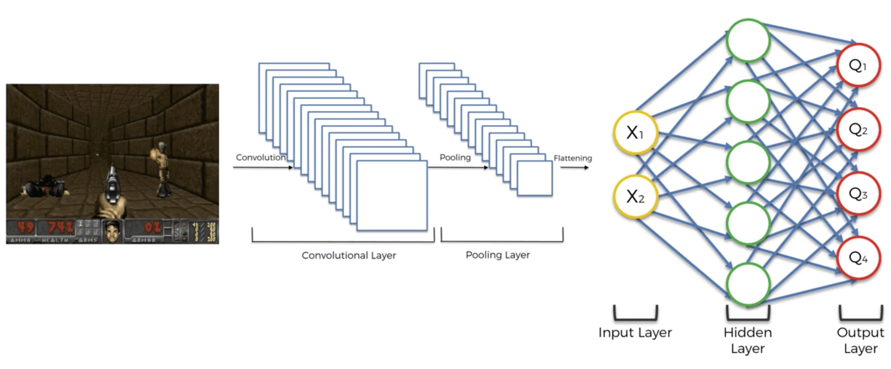


### Asynchronous Actor-Critic Agents (A3C)

#### Idea del A3C

Hasta ahora, la acción que se ejecuta en cada momento ha sido la salida de una red neuronal, como si solo un agente estuviera decidiendo la estrategia para jugar el juego. Este ya no será el caso con A3C. Esta vez, vamos a tener varios agentes, cada uno interactuando con su propia copia del entorno. Digamos que hay $n$ agentes $A_1$, $A_2$,..., $A_n$.

Cada agente comparte dos redes: el actor y el crítico. El crítico evalúa los estados actuales, mientras que el actor evalúa los posibles valores en el estado actual. El actor está acostumbrado a tomar decisiones. En cada época del entrenamiento para el agente, selecciona la última versión de las redes compartidas y usa al actor durante $n$ pasos para tomar una decisión. Sobre los $n$ pasos, recopila todos los nuevos estados observados, los valores de estos nuevos estados, las recompensas, etc. Después de los $n$ pasos, el agente utiliza las observaciones recopiladas para actualizar los modelos compartidos. Los tiempos de época y, por lo tanto, los tiempos de actualizaciones de la red compartida por el agente no son síncronos, de ahí el nombre.

De esa manera, si un agente desafortunado comienza a quedar atrapado en una política subóptima pero atractiva, alcanzará ese estado, porque otros agentes también actualizaron la política compartida antes de que el agente se atasque, y continuará una exploración efectiva.

Para explicar las reglas de actualización del actor y el crítico, veamos las redes como funciones que dependen de los vectores de los parámetros $\theta$ (para el actor) y $\theta_v$ (para el crítico).

#### El proceso al completo del A3C

El algoritmo oficial A3C es el del paper de Google DeepMind, [Métodos asíncronos para el aprendizaje por refuerzo profundo](https://arxiv.org/pdf/1602.01783.pdf). En este artículo se encuentra precisamente dicho algoritmo S3:

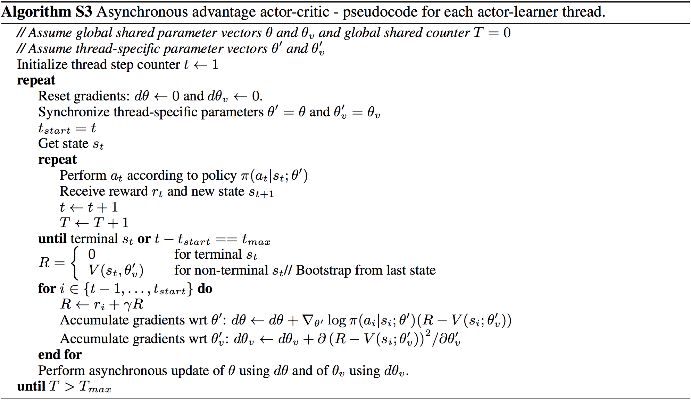

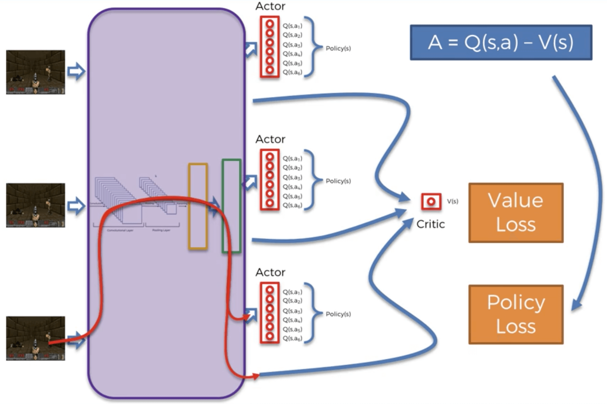


En la figura anterior, podemos ver claramente los tres A del A3C:

* **Asynchronous**: Hay varios agentes, cada uno con su propia copia del entorno, y todos asíncronos (jugando al juego en diferentes momentos).

* **Advantage**: La ventaja es la diferencia entre la predicción del actor, $Q(s, a)$, y la predicción del crítico, $V(s)$:

$$A = Q(s,a) - V(s)$$

* **Actor-Critic**: Por supuesto, podemos ver al actor y el crítico, que por lo tanto generan dos pérdidas diferentes: la pérdida de la política y la pérdida de valor. La pérdida de la política es la pérdida relacionada con las predicciones del actor. La pérdida de valor es la pérdida relacionada con las predicciones del crítico. Durante muchas épocas del entrenamiento, estas dos pérdidas se propagarán nuevamente a la Red Neural, y luego se reducirán con un optimizador a través del gradiente descendente estocástico.

### Búsqueda aleatoria aumentada

#### Problema a resolver

Queremos construir y entrenar una IA que camina o corre por un campo. El campo es un terreno plano que se ve así:


En este mismo campo puedes ver un *Half-Cheetah*. Este será uno de los agentes que entrenaremos para caminar en este campo. Tanto el campo como el agente forman lo que llamamos un entorno, que pertenece a `PyBullet`, la interfaz oficial de Python para Bullet Physics SDK especializada en Simulación de Robótica y Aprendizaje `pr refuerzo, construida y desarrollada por Erwin Coumans. Para obtener más información, puedes leer en [este documento](https://docs.google.com/document/d/10sXEhzFRSnvFcl3XxNGhnD4N2SedqwdAvK3dsihxVUA/edit) o también puede consultar su [página de GitHub](https://github.com/bulletphysics/bullet3).

#### Solución de IA

La solución a nuestro problema es un modelo de IA muy reciente llamado **ARS**, o **Búsqueda aleatoria aumentada**. El documento de investigación relacionado fue publicado por Horia Mania, Aurelia Guy y Benjamin Recht el 20 de marzo de 2018. Puede leer aquí el [documento de investigación completo](https://arxiv.org/pdf/1803.07055.pdf).

ARS se basa en una rama específica de Inteligencia Artificial llamada Estrategias Evolutivas. La diferencia es que en estrategias evolutivas se usan redes neuronales profundas paralelas de varias capas, mientras que ARS usa una política lineal simple, que es un Perceptron (una red neuronal superficial de una capa compuesta de varias neuronas). ARS también es ligeramente similar a **PPO** - **Optimización de política proximal**, en el sentido de que ARS tiene como objetivo optimizar una política (una función de los estados que devuelven las acciones para ejecutar) que realiza las mejores acciones que permiten la IA caminar. Sin embargo, la técnica es diferente. Si tiene curiosidad sobre **PPO**, puedes consultar el [trabajo de investigación](https://arxiv.org/pdf/1707.06347.pdf).

Ahora profundicemos en el ARS.

La idea es en realidad bastante simple. Tenemos una política que toma como entradas los estados del entorno y devuelve como salidas las acciones a ejecutar para caminar y correr por un campo. Ahora, antes de comenzar a explicar el algoritmo, describamos con más detalle las entradas, las salidas y la política.

**Entradas**

La entrada es un vector que codifica los estados del entorno. ¿Qué significa eso? Primero, expliquemos qué es exactamente un estado del entorno en este contexto. Un estado es la situación exacta que ocurre en un momento específico $t$, por ejemplo:


Podemos ver al guepardo en el aire, patas traseras hacia arriba, patas delanteras dobladas, a punto de aterrizar en el suelo. Todo esto está codificado en un vector. ¿Cómo? Simplemente reuniendo suficientes valores que puedan describir lo que está sucediendo aquí. Entonces, el vector codificado contendrá las coordenadas de los puntos angulares del guepardo, así como los ángulos de rotación alrededor de los rotores, y más valores como la velocidad. Por lo tanto, en cada momento $t$, un vector del mismo formato codifica lo que sucede exactamente en el entorno. Este vector codificado es lo que llamamos el estado de entrada del entorno, y será la entrada de nuestra política que intentaremos optimizar.

**Salidas**

El resultado, devuelto por nuestra política, es el grupo de acciones desempeñadas por el agente. Más precisamente, estas acciones son los diferentes impulsos musculares del agente. Por ejemplo, una de las acciones será la intensidad del músculo que empuja la pierna trasera al nivel del pie. Lo que es importante entender aquí es más el hecho de que la política está devolviendo un **grupo de acciones** en lugar de una sola acción. De hecho, una práctica común en el aprendizaje por refuerzo es devolver una acción discreta cada instante $t$. Aquí, no solo devolvemos un grupo de acciones, sino que cada una de estas acciones es continua. De hecho, para que un agente camine en un campo, tiene que mover todas las partes de su cuerpo en cada momento $t$, en lugar de solo una pierna, por ejemplo. Y las acciones son continuas porque los impulsos de los músculos se miden mediante métricas continuas. Por lo tanto, la salida también es un vector de varios valores continuos, al igual que el estado de entrada.

**Política**

Entre las entradas y las salidas tenemos una política, que no es más que una función, tomando como entradas los estados de entrada y devolviendo como salidas las acciones a jugar, es decir, los impulsos musculares. Esta política será lineal, ya que de hecho será un perceptrón, que es una red neuronal simple de una capa y varias neuronas:


La capa oculta en el medio contiene las diferentes neuronas del perceptrón. A cada par de (valor de entrada, valor de salida) se le atribuye un peso. Por lo tanto, en total tenemos number\_of\_inputs $\times$ number\_of\_outputs pesos Todos estos pesos están reunidos en una matriz, que no es más que la matriz de nuestra política lineal. En esta matriz, las filas corresponden a los valores de salida (las acciones) y las columnas corresponden a los valores de entrada (de los estados). Por lo tanto, esta matriz de pesos, llamada $\Theta$, se compone de  $n = \textrm{number\_of\_outputs}$ filas y $m = \textrm{number\_of\_inputs}$ columnas:

$$
\boldsymbol{\Theta}
=
\begin{pmatrix}
(\textrm{input 1, output 1}) & (\textrm{input 2, output 1}) & \cdots & (\textrm{input m, output 1}) \\
(\textrm{input 1, output 2}) & (\textrm{input 2, output 2}) & \cdots & (\textrm{input m, output 2}) \\
\vdots & \vdots & \ddots & \vdots \\
(\textrm{input 1, output n}) & (\textrm{input 2, output n}) & \cdots & (\textrm{input m, output n})
\end{pmatrix}
=
\begin{pmatrix}
\theta_{1,1} & \theta_{2,1} & \cdots & \theta_{m,1} \\
\theta_{1,2} & \theta_{2,2} & \cdots & \theta_{m,2} \\
\vdots & \vdots & \ddots & \vdots \\
\theta_{1,n} & \theta_{2,n} & \cdots & \theta_{m,n}
\end{pmatrix}
$$


**El algoritmo ARS**

**Inicialización**

Al principio, todos los pesos $\theta_{i, j}$ de nuestra política lineal se inicializan a cero:

$$\forall i,j \in \{1,n\}\times\{1,m\}, \theta_{i,j} = 0$$


**Aplicación de perturbaciones a los pesos.**

Luego, aplicaremos algunas perturbaciones muy pequeñas a cada uno de estos pesos, agregando algunos valores muy pequeños $\delta_{i, j}$ a cada uno de los $\theta_{i, j}$ en nuestra matriz de pesos :

$$
\begin{pmatrix}
\theta_{1,1} & \theta_{2,1} & \cdots & \theta_{m,1} \\
\theta_{1,2} & \theta_{2,2} & \cdots & \theta_{m,2} \\
\vdots & \vdots & \ddots & \vdots \\
\theta_{1,n} & \theta_{2,n} & \cdots & \theta_{m,n}
\end{pmatrix}
\longrightarrow
\begin{pmatrix}
\theta_{1,1} + \delta_{1,1} & \theta_{2,1} + \delta_{2,1} & \cdots & \theta_{m,1} + \delta_{m,1} \\
\theta_{1,2} + \delta_{1,2} & \theta_{2,2} + \delta_{2,2} & \cdots & \theta_{m,2} + \delta_{m,1} \\
\vdots & \vdots & \ddots & \vdots \\
\theta_{1,n} + \delta_{1,n} & \theta_{2,n} + \delta_{2,n} & \cdots & \theta_{m,n} + \delta_{m,n}
\end{pmatrix}
$$
\

Llamaremos a esto: "aplicar algunas perturbaciones en una **dirección positiva**" $+\Delta_k$, donde $\Delta_k$ es la siguiente matriz de perturbaciones:

$$
\Delta_k
=
\begin{pmatrix}
\delta_{1,1} & \delta_{2,1} & \cdots & \delta_{m,1} \\
\delta_{1,2} & \delta_{2,2} & \cdots & \delta_{m,2} \\
\vdots & \vdots & \ddots & \vdots \\
\delta_{1,n} & \delta_{2,n} & \cdots & \delta_{m,n}
\end{pmatrix}
$$

"Positivo" viene del hecho de que estamos *agregando* los valores pequeños $\delta_{i, j}$ a nuestros pesos $\theta_{i, j}$. Estas pequeñas perturbaciones $\delta_{i, j}$ se muestrean a partir de una distribución gaussiana $\mathcal{N}(0, \sigma)$ (la desviación estándar $\sigma$ es lo que llamamos "ruido" en el modelo ARS .

Y cada vez que hacemos esto, también aplicamos exactamente las mismas perturbaciones $\delta_{i, j}$ a nuestros pesos $\theta_{i, j}$, pero en la dirección opuesta $-\Delta_k$, simplemente esta vez restando exactamente el mismo $\delta_{i, j}$:

$$
\begin{pmatrix}
\theta_{1,1} & \theta_{2,1} & \cdots & \theta_{m,1} \\
\theta_{1,2} & \theta_{2,2} & \cdots & \theta_{m,2} \\
\vdots & \vdots & \ddots & \vdots \\
\theta_{1,n} & \theta_{2,n} & \cdots & \theta_{m,n}
\end{pmatrix}
\longrightarrow
\begin{pmatrix}
\theta_{1,1} - \delta_{1,1} & \theta_{2,1} - \delta_{2,1} & \cdots & \theta_{m,1} - \delta_{m,1} \\
\theta_{1,2} - \delta_{1,2} & \theta_{2,2} - \delta_{2,2} & \cdots & \theta_{m,2} - \delta_{m,1} \\
\vdots & \vdots & \ddots & \vdots \\
\theta_{1,n} - \delta_{1,n} & \theta_{2,n} - \delta_{2,n} & \cdots & \theta_{m,n} - \delta_{m,n}
\end{pmatrix}
$$

Llamaremos a esto: "aplicación de algunas perturbaciones en la **dirección negativa**" $-\Delta_k$.

Por lo tanto, en conclusión, muestreamos una matriz específica de perturbaciones $\Delta_k$ con algunos valores $\delta_{i, j}$ cercanos a cero y actualizamos los pesos de nuestra matriz $\Theta$ en la dirección positiva $+\Delta_k$ y la dirección negativa $-\Delta_k$:

\begin{align*}
\textbf{Dirección Positiva: } & \Theta \rightarrow \Theta + \Delta_k \\
\textbf{Dirección Negativa: } & \Theta \rightarrow \Theta - \Delta_k
\end{align*}


Y de hecho, sobre cada episodio completo, aplicaremos estas perturbaciones positivas y negativas para muchas direcciones diferentes $\Delta_1$, $\Delta_2$, $\Delta_3$, etc. Haremos esto para 16 direcciones diferentes:

\begin{align*}
\textbf{Direcciones Positivas: } & \Theta \rightarrow \Theta + \Delta_1, \ \Theta \rightarrow \Theta + \Delta_2, \ ... \ , \ \Theta \rightarrow \Theta + \Delta_{16} \\
\textbf{Direcciones Negativas: } & \Theta \rightarrow \Theta - \Delta_1, \ \Theta \rightarrow \Theta - \Delta_2, \ ... \ , \ \Theta \rightarrow \Theta - \Delta_{16}
\end{align*}


Ahora es el momento de preguntar: ¿por qué estamos haciendo esto?

La razón es realmente simple e intuitiva de entender. Queremos actualizar los pesos en estas direcciones diferentes para encontrar las que aumentarán más la recompensa total durante los episodios. Queremos averiguar qué actualizaciones de los pesos conducirán a las recompensas más altas. De hecho, aumentar la recompensa total acumulada durante el episodio es nuestro objetivo final, ya que cuanto mayor sea la recompensa, mejor será la capacidad del agente para caminar.

Ahora otra pregunta, menos obvia: ¿Por qué, para cada dirección, queremos tomar lo positivo y lo negativo?

Esto es porque, una vez que descubrimos las direcciones que aumentan más las recompensas (simplemente obteniendo la recompensa acumulada durante el episodio completo para cada dirección y luego clasificándolas por la más alta obtenida), haremos un paso de gradiente descendente para actualizar los pesos en estas mejores direcciones. Sin embargo, no tenemos ninguna función de recompensa de los pesos, por lo que no podremos aplicar el gradiente descendente directamente. De hecho, para aplicar el gradiente descendente necesitaríamos tener una función de recompensa de los pesos, $r(\Theta)$, y derivarla con respecto a los pesos:

$$\frac{\partial r(\Theta)}{\partial \Theta}$$

y luego hacer el paso de gradiente descendente para actualizar los pesos:

$$\Theta(\textrm{nuevo}) := \Theta(\textrm{antiguo}) + \frac{\partial r(\Theta)}{\partial \Theta} d \Theta$$

Pero no podemos hacer eso porque no tenemos una expresión explícita de la recompensa con respecto a los pesos. Entonces, en lugar de calcular directamente este gradiente, lo aproximaremos. Y ahí es donde entra en juego el combo de direcciones positivas y negativas, con el método de las diferencias finitas.

**Gradiente Descendente aproximado con el método de diferencias finitas.**

Entonces, ahora entendemos que tenemos que hacer un paso de gradiente descendente para actualizar los pesos en las direcciones que aumentan más la recompensa, y que para hacer este paso no tenemos más remedio que aproximar el gradiente de las recompensas con respecto a los pesos. Más específicamente, tenemos que aproximar:

$$\frac{\partial r(\Theta)}{\partial \Theta} d \Theta$$

Bueno, con lo que hemos hecho antes de aplicar las perturbaciones en las direcciones positiva y negativa, podremos aproximar esto fácilmente. Dado que el valor de cada perturbación $\delta$ es un número muy pequeño cercano a cero, entonces la diferencia entre la recompensa $r_{+}$ que obtenemos al aplicar la perturbación en la dirección positiva ($\Theta\rightarrow\Theta + \Delta$) y la recompensa $r_{-}$ que obtenemos al aplicar la perturbación en la dirección negativa (u opuesta) ($\Theta\rightarrow\Theta - \Delta$) es aproximadamente igual a ese gradiente:

$$r_{+} - r_{-} \approx \frac{\partial r(\Theta)}{\partial \Theta}$$

de modo que obtenemos la siguiente aproximación:

$$(r_{+} - r_{-}) \Delta \approx \frac{\partial r(\Theta)}{\partial \Theta} d \Theta$$

Esta aproximación es el resultado del método de diferencias finitas y nos permite hacer este paso de gradiente descendente aproximado.

Luego elegimos una serie de mejores direcciones que queremos mantener como las que conducen a las recompensas más altas y hacemos este paso de Gradiente Descendente aproximado en todas estas mejores direcciones. ¿Cómo sabemos las principales direcciones que aumentan más las recompensas? Bueno, digamos que queremos mantener las 16 mejores direcciones, simplemente aplicamos las perturbaciones positivas y negativas para cada una de nuestras direcciones en un episodio completo, almacenamos el par de recompensas $(r_{+}, r_{-})$ que obtenemos para cada una de estas direcciones, y eventualmente mantenemos los 16 máximos más altos de $r_{+}$ y $r_{-}$. Estas 16 recompensas más altas corresponden a nuestras 16 mejores direcciones.

Luego, finalmente hacemos el promedio de nuestros gradientes aproximados sobre esas 16 mejores direcciones para actualizar toda la matriz de pesos $\Theta$:

$$
\Theta(\textrm{nuevo}) = \Theta(\textrm{antiguo}) + \frac{1}{16}\sum_{k=1}^{16} [r_{+}(\textrm{$k^{esima}$ mejor dirección}) - r_{-}(\textrm{$k^{esima}$ mejor dirección})] \Delta_{\textrm{$k^{esima}$ mejor dirección}}
$$


Justo después de esta actualización, el paso de gradiente sescendente se aplica a toda la matriz de pesos $\Theta$, de modo que los pesos de nuestra política se actualizan en las direcciones principales que aumentan más la recompensa acumulada.

**Bucle de entrenamiento**

Finalmente, repetimos todo este proceso (salvo el paso de la inicialización de los pesos a cero) para un cierto número de pasos (por ejemplo, 1000 pasos).

Podemos mejorar el rendimiento del ARS con los dos siguientes elementos de acción:

* Normalización de los estados
* Escalado de la desviación estándar de la recompensa
* Ajuste de la tasa de aprendizaje

Echemos un vistazo a cada una de estas soluciones:

**Normalización de los estados**

En el siguiente [trabajo de investigación](https://arxiv.org/pdf/1803.07055.pdf), tenemos las opciones entre *V1* y *V2* (ver la página 6). *V1* es el algoritmo anterior sin normalizar los estados de entrada, y *V2* es el ARS con estados de entrada normalizados.

La normalización de los estados mejora claramente el rendimiento.

**Escalado de la desviación estándar de la recompensa**

Podemos escalar dividiendo la suma anterior en la ecuación (1) por la desviación estándar $\sigma_r$ de la recompensa, para obtener:

$$
\Theta(\textrm{new}) = \Theta(\textrm{old}) + \frac{1}{16 \sigma_r} \sum_{k=1}^{16} [r_{+}(\textrm{$k^{th}$ best direction}) - r_{-}(\textrm{$k^{th}$ best direction})] \Delta_{\textrm{$k^{th}$ best direction}}
$$

**Ajustar la tasa de aprendizaje**

Para ajustar los parámetros del algoritmo, podemos agregar un factor de tasa de aprendizaje en la ecuación (2) (denotado por $\alpha$ en el documento):

$$
\Theta(\textrm{new}) = \Theta(\textrm{old}) + \frac{\alpha}{16 \sigma_r} \sum_{k=1}^{16} [r_{+}(\textrm{$k^{th}$ best direction}) - r_{-}(\textrm{$k^{th}$ best direction})] \Delta_{\textrm{$k^{th}$ best direction}}
$$

## Anexo 3: Preguntas y Respuestas

### P&R de la Parte 1 - Optimización de Procesos

**¿Qué son el Plan y la Política?**

En pocas palabras, el plan es el proceso de crear el entorno de los estados de entrada, y la política es la función que toma los estados de entrada definidos por el plan como entradas y devuelve las acciones a ejecutar como salidas. Así, en el estudio de caso, todo el proceso que hacemos de definir el entorno de almacén es nuestro plan y la política es nuestra IA. Echa un vistazo a los siguientes enlaces, ya que pueden ayudarte a obtener un contexto adicional:

* [Link 1](http://www-anw.cs.umass.edu/~barto/courses/cs687/Chapter\%209.pdf)
* [Link 2](https://www.quora.com/In-artificial-intelligence-which-is-better-policies-or-plans-and-why)

**¿Quién y cómo determina el factor de descuento en la ecuación de Bellman?**

Está determinado por el desarrollador de IA a través de la experimentación. Primero se intenta con 1 (sin descuento), luego se disminuye un poco y se observa si obtienen mejores resultados. Y al repetir esto se encuentra un valor óptimo.

Aquí se agregarán más preguntas y sus respuestas, tan pronto como se hagan preguntas relevantes dentro del curso.

### P&R de la Parte 2 - Minimización de Costes

**En Deep Reinforcement Learning, ¿cuándo usar Argmax vs Softmax?** 

Utilizamos Argmax para problemas no demasiado complejos (como problemas de negocios) y Softmax para problemas complejos como la IA de un videojuego o hacer que un robot camine. De hecho, para los problemas complejos se suele necesitar hacer un poco de exploración vs explotación, y eso es exactamente lo que Softmax nos permite hacer. Sin embargo, los problemas empresariales no son demasiado complejos, por lo que no es necesario explorar mucho y, por lo tanto, un método Argmax suele ser suficiente.

**¿Hay alguna razón específica para elegir dos capas con 64 y 32 neuronas para la arquitectura del cerebro? ¿Deberíamos prestar atención al sobreajuste?**

Lo que debemos hacer es comenzar con algunas arquitecturas clásicas que encontramos en los documentos (ImageNet, ResNet, Inception, MobileNets, etc.). Luego intentamos, vemos si obtenemos buenos resultados, y si ese es el caso, podemos detenernos allí. Para nuestro redes neuronales profundas, simplemente tomamos una arquitectura clásica, con 2 capas completamente conectadas de 64 y 32 neuronas, que resulta funcionar muy bien para nuestro caso de estudio. Luego, hemos evitado el sobreajuste en el curso aplicando dos técnicas diferentes. Estas nos permiten mejorar el modelo y, por lo tanto, mejorar la puntuación. Estas dos técnicas son:

* Parada temprana (Early Stopping)
* Capa de olvido (Dropout)

Aquí se agregarán más preguntas y sus respuestas, tan pronto como se hagan preguntas relevantes dentro del curso.

### P&R de la Parte 3 - Maximización de Beneficios

**¿Podríamos ver con mayor detalle qué es una distribución? ¿Qué hay en el eje $x$ y el eje $y$?**

Supongamos que tenemos un experimento para seleccionar la estrategia que se mostrará a los clientes un total de 100 veces (es decir, con 100 clientes separados, uno tras otro), y calculamos la frecuencia de la selección de la estrategia. Luego lo repetimos nuevamente por otras 100 veces. Y nuevamente por otras 100 veces. Por lo tanto, obtenemos muchas frecuencias. Si repetimos tales cálculos de frecuencia muchas veces, por ejemplo 500 veces, podemos trazar un histograma de estas frecuencias. Según el Teorema central del límite, tendrá forma de campana y su media será la media de todas las frecuencias que obtuvimos durante el experimento. Por lo tanto, en conclusión, en el eje $x$ tendremos los diferentes valores posibles de estas frecuencias, y en el eje $y$ tendremos el número de veces que obtuvimos cada frecuencia durante el experimento.

**En la primera clase de teoría del curso, ¿por qué D5 (en naranja) es la mejor distribución? ¿Por qué no es D3 (en rosa)?**

En esta situación, 0 es perder y 1 es ganar. El D5 es el mejor porque está sesgado, por lo que tendremos resultados promedio cercanos a 1, lo que significa que allí tenemos más ganancias. Y en realidad todas las máquinas de casino hoy en día están cuidadosamente programadas para tener distribución como D1 o D3. Pero es un buen ejemplo concreto.

**En el siguiente gráfico, ¿por qué la marca amarilla es la mejor opción y no la marca verde?**


La marca amarilla es la mejor opción porque es la más alejada del origen en el eje x, lo que significa que tiene el mayor retorno estimado.

**No entiendo cómo y por qué el muestreo de Thompson puede aceptar feedback a posteriori.**

Al realizar el muestreo de Thompson, aún podemos realizar actualizaciones en nuestro algoritmo (como hacer nuevas conjeturas para las distribuciones con datos existentes, tomar muestras de la distribución adivinada, etc.) mientras esperamos los resultados de un experimento en el mundo real. Esto no impedirá que nuestro algoritmo funcione. Es por eso que puede aceptar feedback a posteriori.

**¿Cuáles son otros ejemplos de aplicaciones de muestreo de Thompson?**

El ejemplo más clásico es la optimización de la tasa de conversión. Tenemos varios anuncios de un mismo producto y deseamos saber cuál tiene el CTR más alto. Así que haríamos lo mismo que hicimos con las estrategias, excepto que esta vez los brazos serán los anuncios. 

Otra aplicación potencial de bandidos con múltiples brazos (MAB) puede ser la prueba en línea de algoritmos. Por ejemplo, supongamos que está ejecutando un sitio web de comercio electrónico y tiene a su disposición varios algoritmos de Machine Learning para proporcionar recomendaciones a los usuarios (de lo que sea que el sitio web esté vendiendo), pero no sabemos qué algoritmo conduce a las mejores recomendaciones. Podríamos considerar este problema como un problema MAB y definir cada algoritmo de Machine Learning como un "brazo": en cada ronda cuando un usuario solicita una recomendación, se seleccionará un brazo (es decir, uno de los algoritmos) para hacer las recomendaciones, y recibir una recompensa En este caso, se puede definir la recompensa de varias maneras, un ejemplo simple es "1" si el usuario hace clic / compra un artículo y "0" en caso contrario. Finalmente, el algoritmo de bandido multi brazo convergerá y terminará eligiendo siempre el algoritmo más eficiente para proporcionar recomendaciones. Esta es una buena manera de encontrar el modelo más adecuado para resolver un problema en línea. 

Otro ejemplo que se me viene a la mente es encontrar el mejor tratamiento clínico para los pacientes: cada tratamiento posible podría considerarse como un "brazo", y una forma simple de definir la recompensa sería un número entre 0 (el tratamiento no tiene ningún efecto) y 1 (el paciente se cura perfectamente). En este caso, el objetivo es encontrar lo más rápido posible el mejor tratamiento y, al mismo tiempo, minimizar el arrepentimiento acumulativo (lo que equivale a decir que desea evitar lo más posible la selección de tratamientos "malos" o incluso subóptimos durante el proceso).


**¿Dónde puedo encontrar algún recurso excelente en la distribución Beta?**

El mejor que conozco es el [siguiente](https://stats.stackexchange.com/questions/47771/what-is-the-intuition-behind-beta-distribution)


**Tengo curiosidad por saber cómo se aplicaría Thompson Sampling de manera proactiva al ejecutar esta campaña de estrategia teórica. ¿Repetiríamos el programa en cada ronda?**

Primero, un ingeniero de datos crearía un flujo completo para leer datos del sitio web y reaccionar a ellos en tiempo real. Luego, una visita al sitio web, activaria una respuesta para recalcular los parámetros y elegir una estrategia para la próxima vez.

Aquí se agregarán más preguntas y sus respuestas, tan pronto como se hagan preguntas relevantes dentro del curso.
